# 常见开源告警系统对比分析(prometheus、open-falcon、zabbix)
[toc]
本文根据邓欢在2018年7月78日高效运维社区【数据库专场沙龙】现场演讲内容整理而成。
## 告警的选型
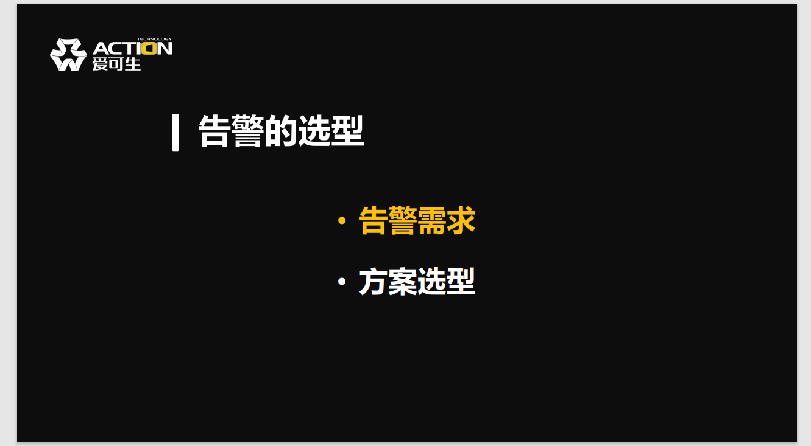
在告警选型的时候，首先给大家介绍一下我们的需求，然后我将会从需求出发确定方案选型。
### 告警需求
我们需求主要来自于三个方面：
- 告警的对接
- 告警的收敛
- 告警的可用性

我们是一家乙方公司，通常服务于各种甲方爸爸，不同甲方爸爸有不同需求。比如甲方爸爸如果有自己的监控系统，希望我们的监控系统能与他们的监控系统进行对接。在与甲方爸爸接触过程中我们曾遇到这样的客户，有一天他跟我们说他最新买的苹果手机被他换掉了，因为他的手机经常会死机，死机的原因就是他收到了太多的告警，最后他专门买了一个安卓手机用来接收告警。所以我们第二个告警需求，需要将告警进行收敛。

​    

关于第三个问题，我想问下大家，假如长时间没有收到告警消息，你们是会认为自己系统运行的很完美，还是会担心告警系统挂掉了。如果是告警系统挂掉了，不能及时把告警发出来，那么最后这个锅到底由谁来背。大家都不希望背锅，所以告警第三个问题需要解决告警的可用性问题。

​    

下面分别从三个方面介绍一下每个方面具体要解决什么样的问题。

#### 告警的对接
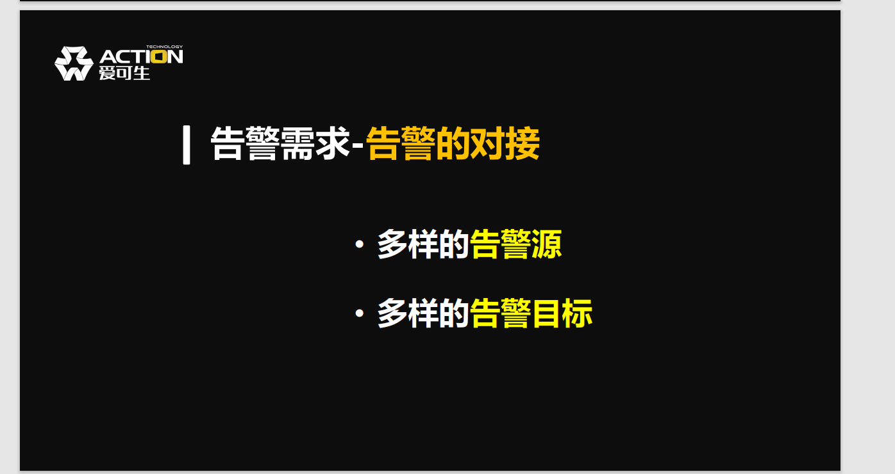

大多数告警通过监控系统发出，有部分告警可以通过服务直接发出，所以我们希望支持多样的告警源。对于多样告警目标，不同公司可能用的办公软件都不一样，有的公司用微信进行通讯，有的公司通过钉钉进行接收消息，而客户希望我们把告警发到他们聊天工具中去。不同人员的需求也不同，运维人员习惯通过短信接收告警，大BOSS更喜欢用邮件接收告警，所以我们告警对接需要解决的第二个问题是多样的告警目标。

#### 告警的收敛
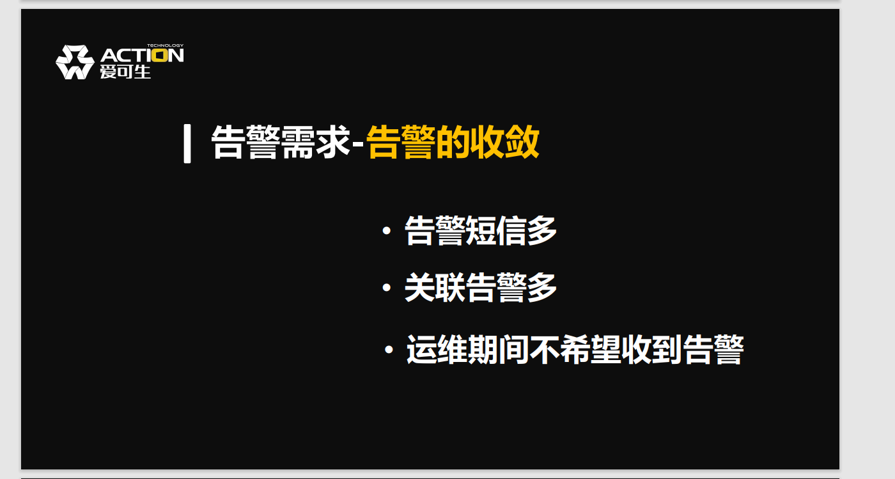
大家是否遇到这样问题，收到一个告警然后开始排查问题，但是排查问题过程中告警消息不停地发送过来。处理故障就是精神高度紧张的时候，重复告警消息发过来，不仅对解决问题没有任何帮助，反而会增加运维人员压力。所以我们要收敛过多的告警消息。

假设有一台服务器挂掉了，这台服务器首先会发送一个告警告诉你这台服务器挂掉了，这台服务器上面运行其他服务也被监控系统给监测到了，并且这些服务的告警消息也会发出来。但是实际上只有服务器挂掉这一条信息能帮助我们解决问题，所以我们告警的收敛解决关联告警过多的问题。

关于运维期间不希望收到告警主要是因为运维通常会在大半夜进行，运维期间很有可能会产生一些告警。如果大BOSS接到报警马上打电话过来，这个压力可不小。所以这个时间段运维一般不希望把告警发出来，因此告警收敛需要解决的第三个问题是运维期间不希望收到告警。

#### 告警的可用性 
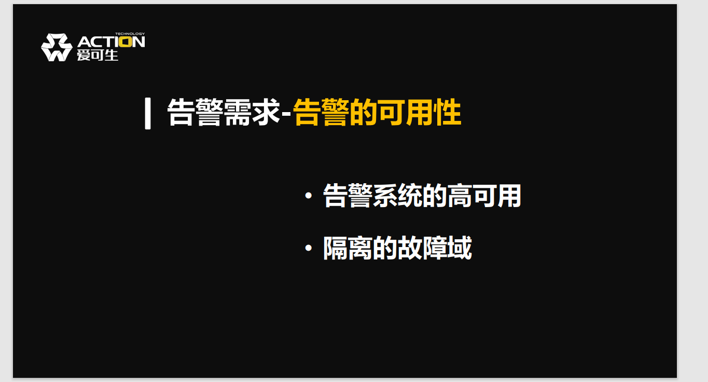
接下来看告警可用性需要解决什么样的问题。前面我们说过我们不希望背锅，所以我们必须要实现告警系统的高可用。

关于第二个隔离的故障域，有的监控系统和告警系统绑定在一起，如果监控系统挂掉，告警系统同样挂掉，所以我们希望监控系统和告警系统是分开部署的。

 

下面我们将针对这三个方面的需求，来进行方案选型。

### 告警的选型
#### 备选方案
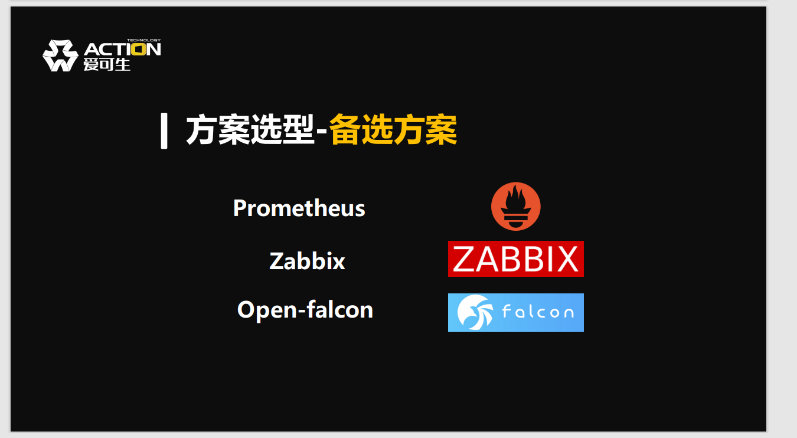

- Prometheus

- Open-falcon

- Zabbix

#### 方案对比
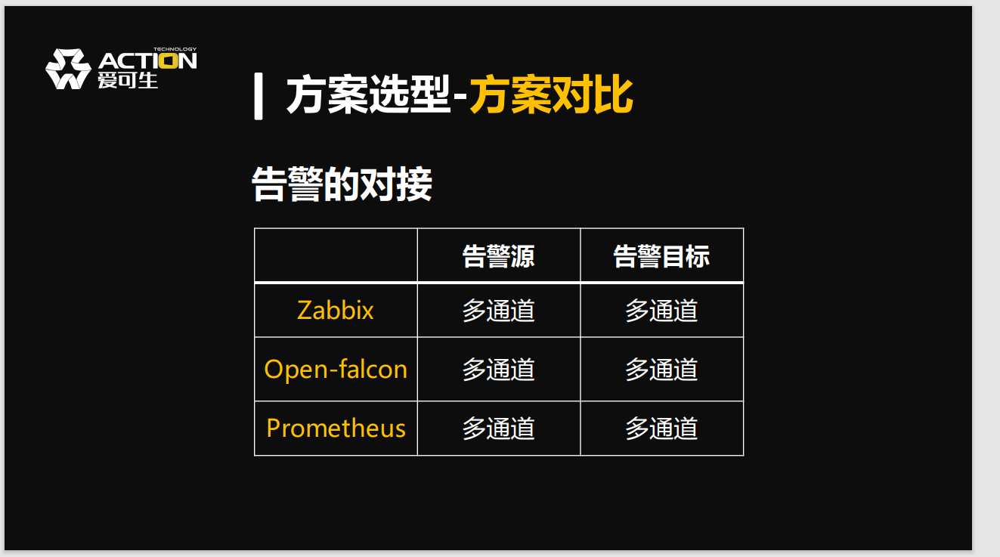
我们从市面上调研了一些监控系统，其中比较流行的是Prometheus、Open-falcon、Zabbix。根据自身需求对这三个监控系统进行对比，首先我们进行对接方面的对比。这三个系统它们都可以支持多通道的告警源，同时可以支持多通道的告警目标，所以在这个需求上面，这三个方案都是满足的。
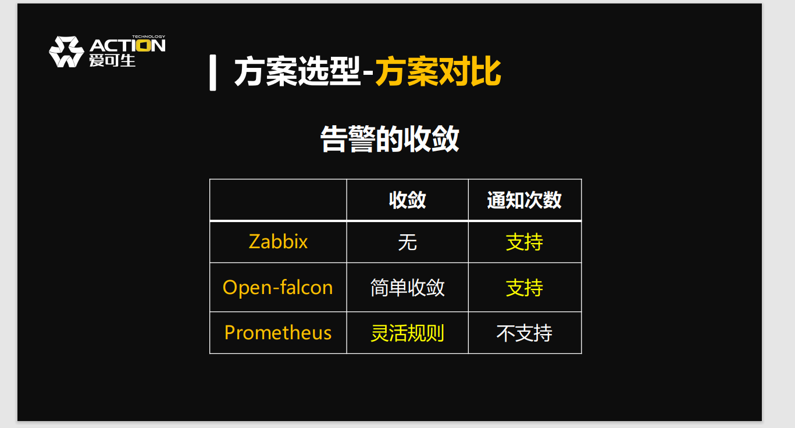
关于告警的收敛。Zabbix 在告警的收敛上面没有任何的支持。Open-falcon只进行了一些简单的收敛，比如一段时间内重复的告警，它不会重复的发送。而Prometheus提供了灵活的规则，能够满足在不同场景下的需求。但是通知次数上面，Open-falcon和Zabbix都限制了最大通知次数，Prometheus则没有最大通知次数的限制，在这一点上上面两个方案比Prometheus好一点。
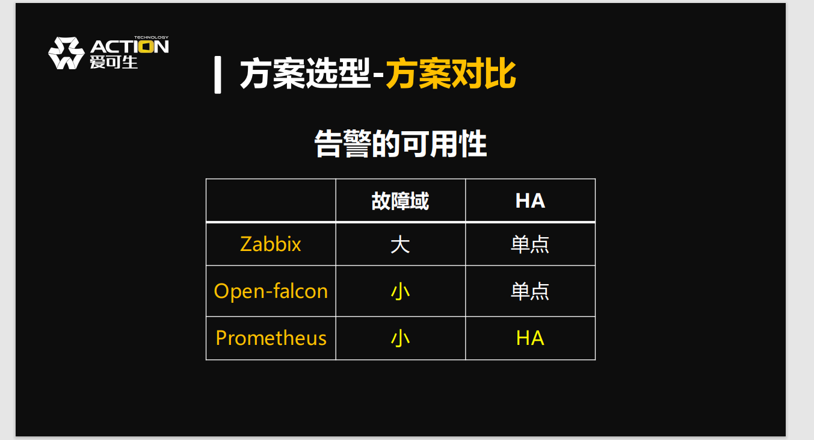
第三个需求方面的支持。首先是Zabbix，监控系统和告警系统绑定在一起，所以它的故障域很大。Open-falcon和Prometheus，其监控系统和告警系统都可以单独的部署，所以它的故障域相对来说要小，但是Open-falcon所有的组件都支持高可用，除了它的告警系统以外，这一点是比较遗憾的。

 

然后我们还考量了一些其他的方面：
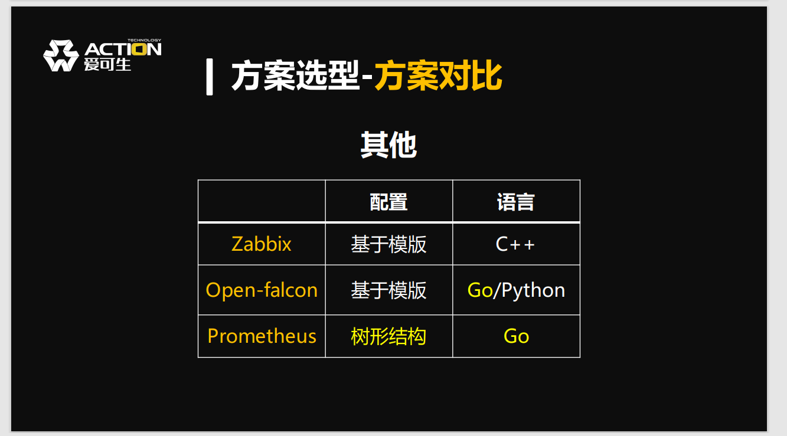
**第一点是配置**，Open-falcon和Zabbix都是基于模板的配置，而Prometheus提供的是一种树形的配置，我们通过对比发现树形配置比较灵活，而且学习成本也相对较低。

**第二点是语言**，我们公司的大多数产品都是使用GO语言，所以我们希望选择的方案能够贴合我们的技术栈。通过以上方面的比较，我们最终选择了Prometheus作为我们的方案选型。Prometheus它是一整套的解决方案，它包括了监控系统Prometheus，以及告警的展示Grafana，以及它的告警系统Alertmanager。

总结:
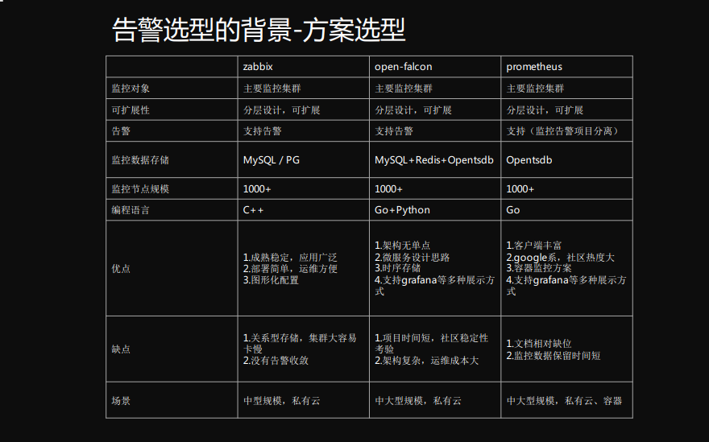

## Alertmanager的实现
下面为大家介绍告警系统Alertmanager的实现。

在介绍实现的时候，首先介绍一下它的架构。然后针对我们前面提到的三点需求对接、收敛和可用性来介绍它的实现，中间可能会穿插一点它的配置。
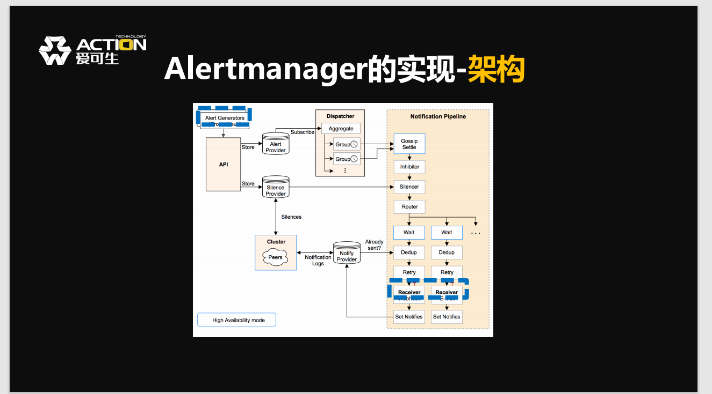
**首先，输入和输出。**从输入上来看，虽然它是Prometheus一个项目，它可以接收Prometheus发出告警，也可以支持其他的监控系统发过来的告警。从输出来看，每一个告警消息都可以定义不同的接收者，从而实现我们多元化告警目标的需求。
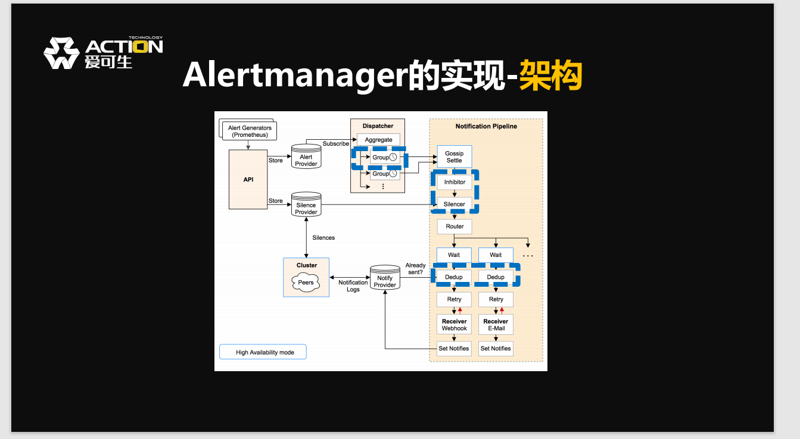

**其次，中间的流程，**Alertmanager收到告警之后会将告警进行分组，每一个分组都会有进行抑制和静默过程，下面还会进行去重，所以它的收敛方式非常的丰富。
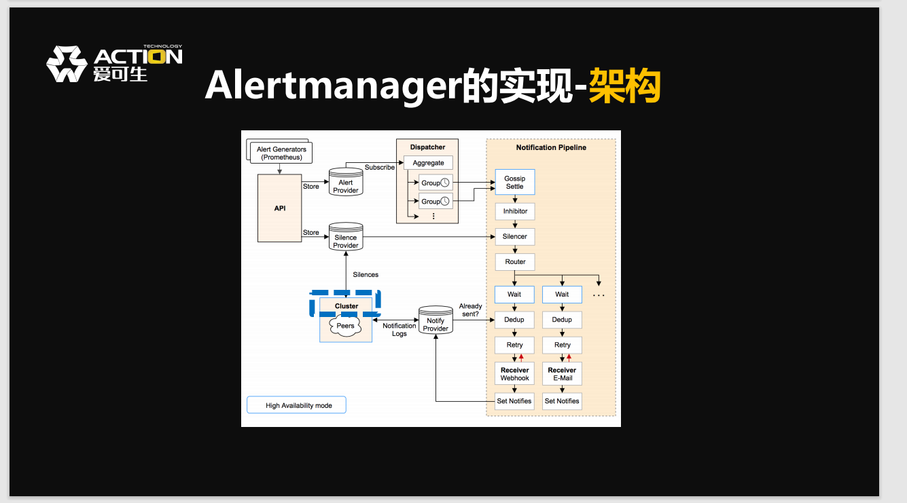

**然后，高可用**，从这里可以看出Alertmanager它也提供了高可用了支持。

 

下面我们具体的看一下三个方面的需求如何满足。

### 对接
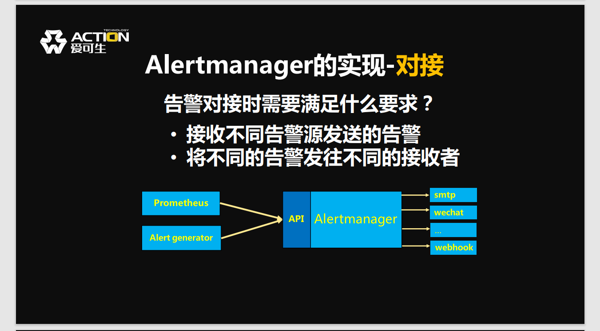

对接方面的需求，首先对接需要接收不同的告警源发送的告警。比如我们用监控系统Prometheus，也有可能我们自己的服务也会发送报警。同时客户希望将不同的告警发往不同的接收者，所以我们在对Alertmanager收敛之后，把告警发到不同的接收者上面去。
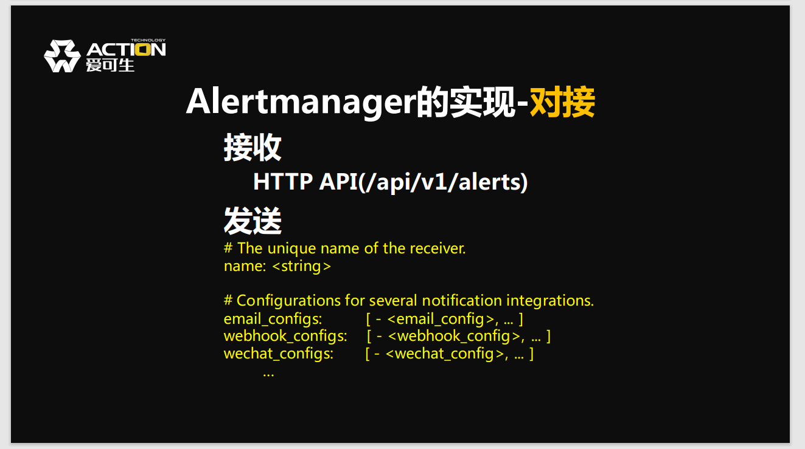

Alertmanager它通过提供一个统一的API接收不同告警。对于发送的话，在这里可以配置接收者，接收者不仅仅可以是一个个人，可以是一个团体，也可以是第三方平台。对于个人而言可以配置邮件，在邮件配置里面可以配置多个邮件地址，也可以配置一个邮件地址。对企业而言可以配置微信，让告警发到你们公司微信企业号上；对接第三方平台的话，提供外部的配置，让告警发到第三方平台，比如钉钉类似的通信工具。

### 收敛
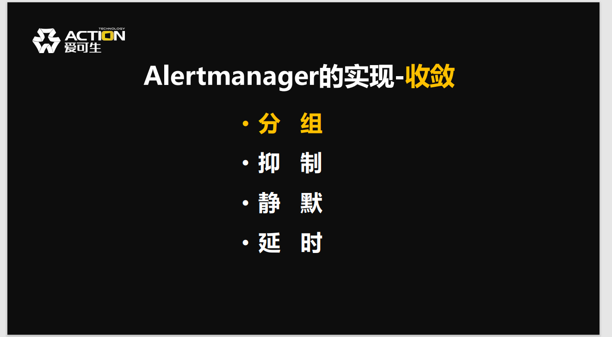
接下来我们看一下Alertmanager关于收敛的支持，Alertmanager收敛提供四种方式：

- 分组

- 抑制

- 静默

- 延时

#### 分组的支持

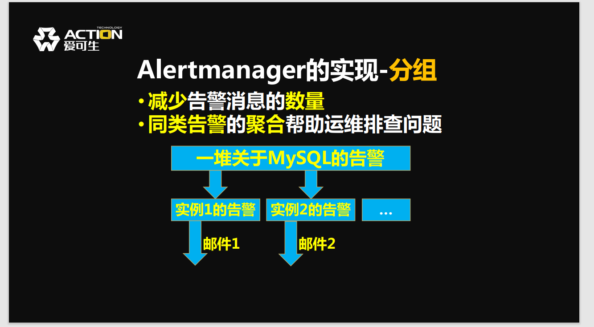
假设有一大堆关于MySQL的告警，但是希望在分析问题时能够针对不同的实例进行，所以可以针对不同实例进行分组。每一个告警都会被分往不同实例分组中去，每一个分组最后都会合成一个消息发送给接收者。所以最后运维人员收到的是一封封邮件，而每一封邮件都是关于一个实例的告警。通过这种方式有效的减少了告警消息数量；每一封邮件都是关于一个实例的告警，这种方式可以帮助运维排查一些问题。

​    

举一个具体的例子。假设MySQL A产生了一个报警，另外一台MySQL B，这台MySQL挂掉了，监控系统检测到IO线程和SQL也挂了。通过ID进行分组，不同的实例分配到不同的分组，最后运维将会收到两条告警消息，一条是关于MySQL A CPU过高的告警；另外一条是关于MySQL B挂掉的告警消息。

#### 告警的抑制

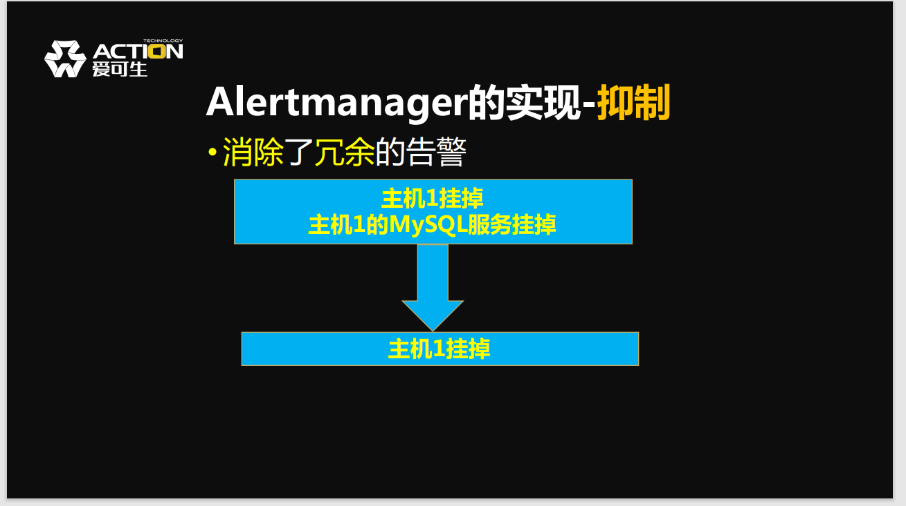
假设有一台主机挂掉了，上面运行着MySQL的服务，这个时候主机挂掉和MySQL挂掉的两条告警到达Alertmanager的顺序可能不一样，运维人员接收的告警顺序也可能不一样。如果先收到MySQL服务挂掉的告警，排查问题的思路可能就往别的方向走了，但是实际上这不是最根本的原因，所以我们可以通过抑制，将主机挂掉的告警把这主机上面MySQL服务挂掉告警抑制掉，最后只收到主机挂掉的告警。这样能够把冗余信息消除掉，最后得到故障发生最本质的原因。

 

这是一个具体的例子，这个例子和上面讲的是类似的。假设MySQL服务器A上面运行着MySQL服务，当这台服务器突然宕机时候，这两条告警都会出来，但是你配置一条抑制规则，抑制掉MySQL的告警，最后收到服务器挂掉的告警。

#### 静默

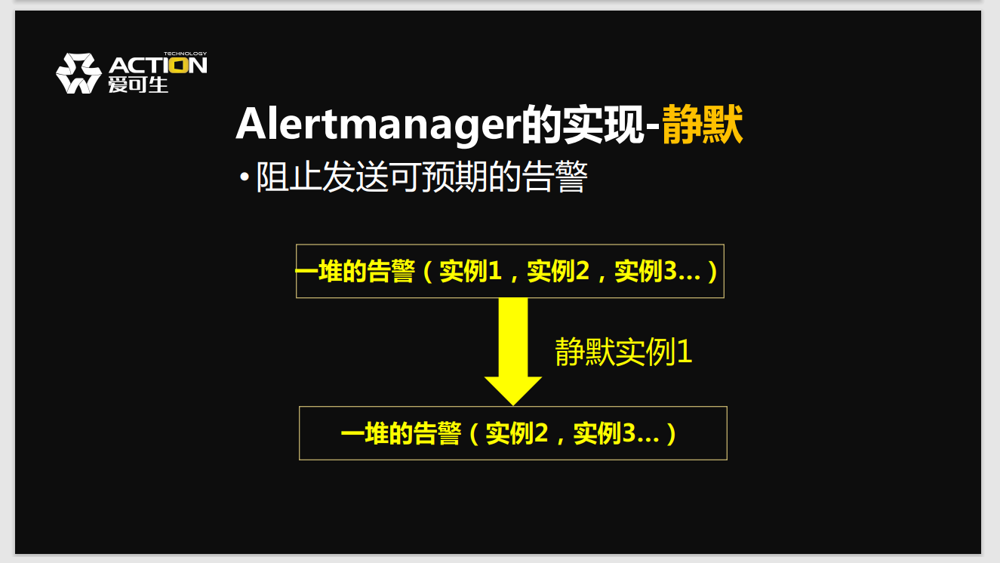

假设你有一堆分别关于MySQL实例1、2、3的告警，但是出于某些方面的原因不希望收到关于实例1的告警，可以设置静默规则把它静默掉，最后就能不再收到关于这台实例的告警，但是你仍然可以收到其他实例的告警，通过这种方式你可以阻止系统发送一些可以预期的告警。

​    

举例，假设要在MySQL A上面跑一个批处理任务，这个批处理任务消耗系统资源比较大，会触发这些告警。同时你的系统中还有一台MySQL B的服务器，这个是对外提供服务的，你不希望把它的报警给静默掉，所以可以配置一条静默规则，把MySQL A告警给静默掉，最后就收不到关于MySQL A的告警，同时其他服务不会被影响到。

#### 告警的延时

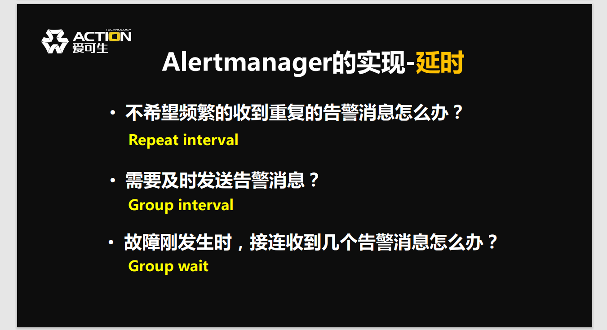

假设系统发生故障产生告警，每分钟发送一条告警消息，这样的告警信息十分令人崩溃。Alertmanager提供第一个参数是repeat interval，可以将重复的告警以更大频率发送，但是只有这个参数会带来两个的问题。第一个问题是告警不能及时收到。假设当前发送一条告警，下一次告警在一个小时之后，但在这一个小时之内系统产生了一条告警，这时告警无法被及时发出去。所以alertmanager提供了第二个参数group inteval，让报警能够及时的发送出去。

 

另一个问题，当故障发生时，告警条件一个个被满足，到达Alertmanager的顺序也分先后，所以在最开始的时候可能收到多个消息。Alertmanager提供了第三个参数叫做group wait，在一个分组收到第一条报警消息之后，通过等到group wait，把故障最开始发生时候产生告警收敛掉，最后作为一条消息发送出来。

### 配置

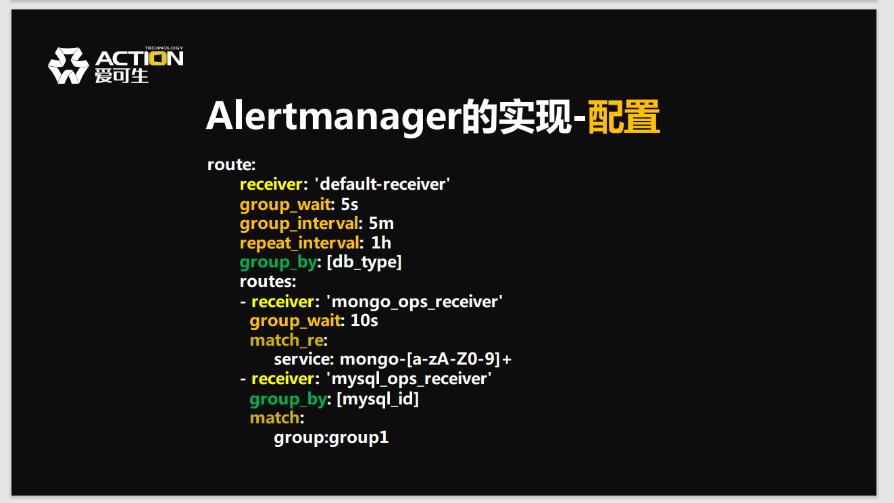

下面我们讲一下Alertmanager的配置，前面我们提到Alertmanager使用的是树形配置。树形配置每一个节点定义一个路由规则，匹配路由规则的告警都发送给同一个接收者，前面提到接收者可以通过不同方式进行接收。Alertmanager的树形配置根接点，必须匹配所有告警，因为每一条告警都必须有一个接收者。

假设所有的告警中，对于MongoDB和MySQL有专门的人员在负责，所以在根节点下面配了两个子节点，分别匹配这两个报警。对于这两个服务的告警，会分别发送不同运维人员手上。但是在所有的MySQL服务当中有两类服务是特别重要的，他们分别在group1和group2里面。所以当希望MySQL服务出现告警，并且是属于group1时，让它发往group1的负责人；对于group2出现的问题由group2的负责人去处理；对于其他MySQL出现问题，由MySQL的运维人员去处理。如果是Zabbix，那么可能将要定义特别多的模板，相对来说Alertmanager提供的配置比较简洁，而且也相对灵活。

 

这是它配置的实现，配置格式是yml的。首先需要配置接收者，然后通过这个group by定义的标签将告警进行分组。根路由下面定义了两个子节点，分别将MongoDB和MySQL的告警发给各自的负责人。在每个节点可以设置不同的延时时间，并且它们分组方式也可以不一样。

### 可用性

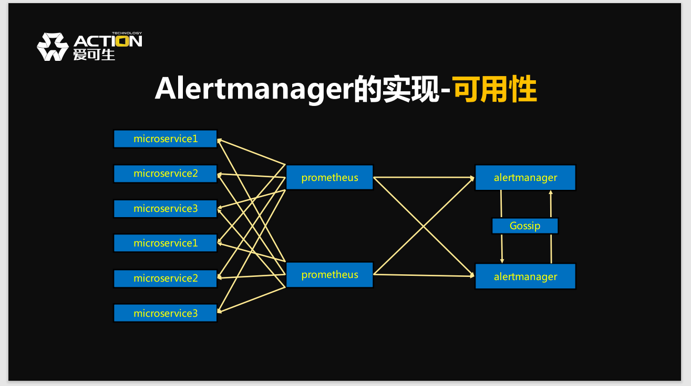

这一小节将介绍Alertmanager高可用的实现方式。在Prometheus项目的官方介绍中，Alertmanager是单独部署的，每一个Alertmanager它都单独接收来自Prometheus的告警，然后单独的将告警进行收敛，最后发送出去。但是会有一个问题，不同的Alertmanager实例可能会发送相同的告警。所以在每一个Alertmanager发送告警之前，它通过Gossip协议去其他实例获取当前已经有哪些告警发送出去，如果当前想发送的告警已经发送出去了，就不会再发送，从而避免多个Alertmanager发送同一个告警的问题。

## Alertmanager的实践

下面我给大家介绍一下我们的实践经验，首先我会给大家介绍我们的架构，然后是我们的调度层级，最后我们会介绍一些关于SRE的问题。

- 架 构

- 调度层级

- SRE

### 架构

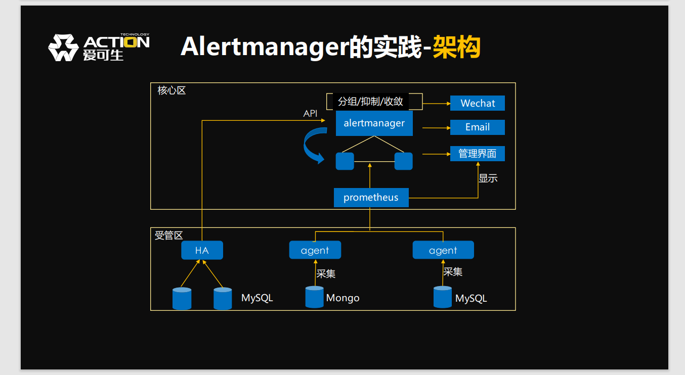

这是我们的架构，分为核心区和受管区。

 

在核心区我们部署监控组件Prometheus和告警组件Alertmanager。在受管区是我们的数据采集服务和被监控的服务。我们通过Agent采集不同服务状态，Prometheus会定期从Agent收集数据，单独进行规则判定。如果满足告警规则的话，会往Alertmanager发送告警。

 

同时Prometheus作为一个监控组件，也提供了监控数据的来源，可以直接展示系统监控数据。我们把Prometheus发送的告警称之为阈值告警，还有一类叫做动作告警。动作告警不像阈值告警定期采集数据获取，它就是一个动作。比如我们高可用组件把MySQL组成切换了，它会马上把告警发送出去。

### 调度层级
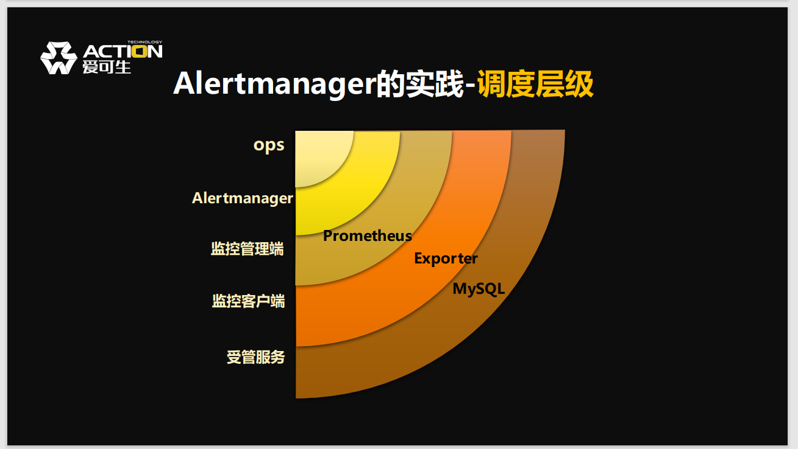

接下来看我们调度层级，我们使用的是经典的error kernel模型，比如我们的MySQL实例，上面是监控客户端，监控客户端定期去MySQL实例采集数据。再上面是我们监控管理端，监控管理端定期从监控客户端拉取数据，从而进行规则判定。如果它发送告警，会往上一层Alertmanager发送。

 

我们并没有采用Alertmanager本身提供的高可用实现方式。因为在我们选型的时候，这个组件还处于活跃的开发状态，当时它的高可用并不是那么的可靠，所以我们把Alertmanager和Consul联合在一起，它实现了Raft协议，我们通过Raft一致性协议来保证Alertmanager高可用。

 

同时我们也实现了反向告警的机制。通常运维人员收到一条告警时候，系统一定出现一个故障，运维人员需要采取动作。但是运维人员收到反向告警不需要采取什么措施。因为收到一条反向告警，意味着整个集群正常工作，如果整个集群都不能正常工作反向告警是发不出来的。

### SRE

接下来我们讲一讲SRE。SRE是谷歌的站点可靠性工程，它对监控系统提出了两点建议。

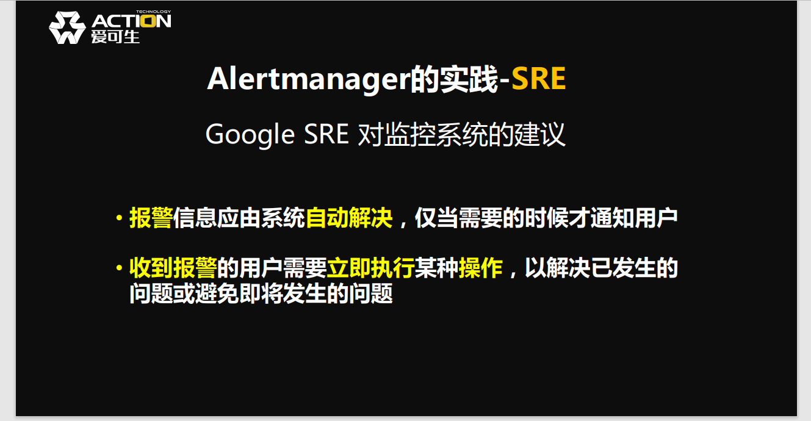

#### 第一点建议

报警信息应由系统自动解决，仅仅是当需要的时候通知用户。其实告警系统的存在完全是因为系统的不完善导致的，如果系统足够可靠，不可能发生故障，或者能处理掉发生的故障。不能处理的时候需要发送一个告警让人员来介入，但是让人员来介入效率比较低。

#### 第二点建议
收到报警需要用户立即执行某种操作，解决已经发生或者即将发生的问题。针对SRE建议，我们有一些实践是遵循了它的建议，但是有一些根据我们的实际需要，我们并没有遵循它的建议。

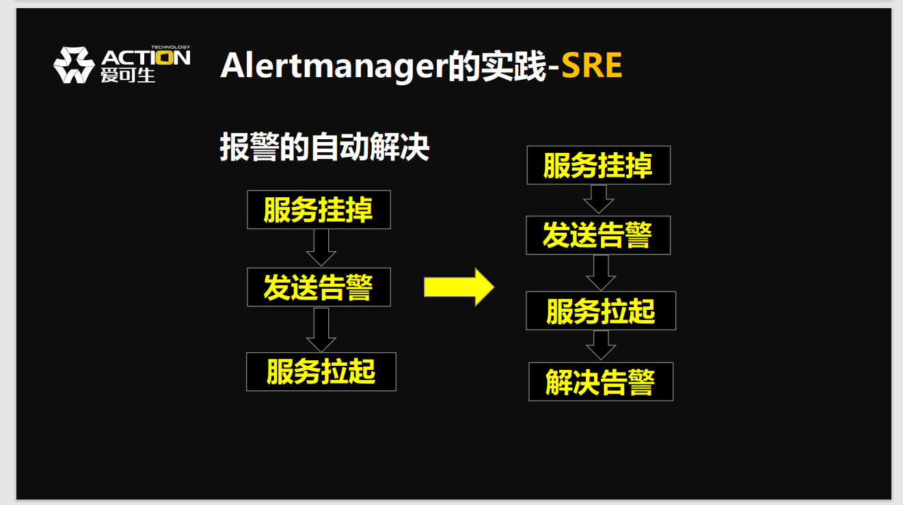

我们第一个实践是遵循了它的建议，我们之前说过告警分为阈值告警和动作告警，通常在动作告警当中服务挂掉了会发送一个告警，但是服务被拉起时告警并没有解决掉，我们遵循了报警自动解决建议，服务拉起之后把原来的告警给解决掉。

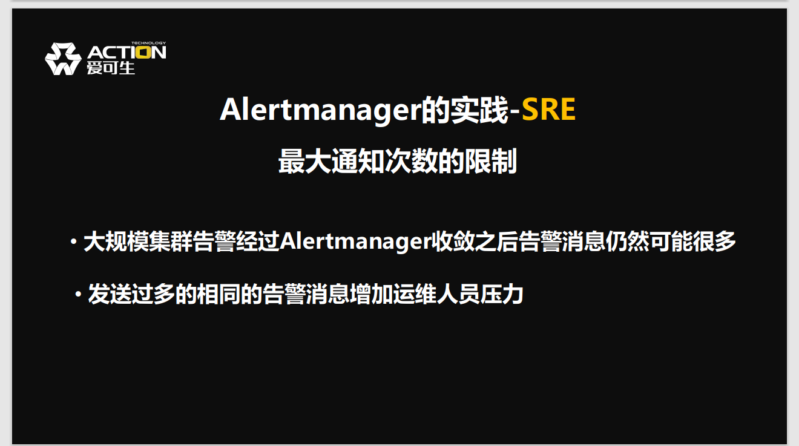

下面一个，我们没有遵循它的SRE建议，我们在选型的时候说过Alertmanager有个缺陷，不支持通知次数的限制。其实Alertmanager是由谷歌出来一帮人研发的，所以他们所做的工作会遵循SRE。但是实践中发现大规模集群通过Alertmanager收敛之后，发出来消息仍然可能特别多，并且过多的告警消息在运维人员解决问题的时候是并没有帮助的，所以我们为了人性化的体验，增加了最大通知次数的限制，虽然这违反了它的一些建议。
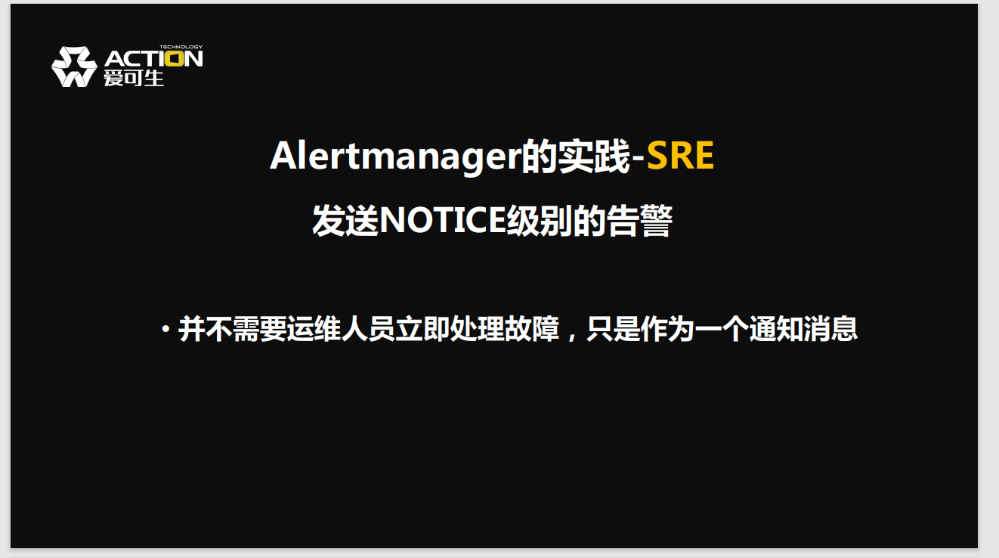

我们下一个实践的经验是发送notice级别的告警，这一点也没有遵循它的建议。因为按照它的建议不需要运维人员介入的告警不需要发送给运维人员。但是我们需要知道系统发生了这样一种状况，并且知道发生状况的原因是什么，所以我们增加了notice级别的告警。

​    

下面是我们的告警展示，这是我们自己的实践。
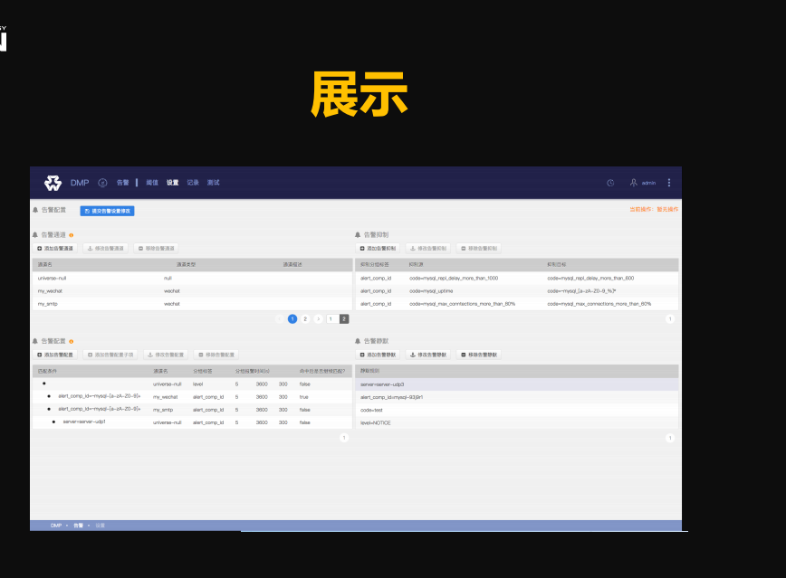

最后给大家推荐的是《Google SRE运维解密》这本书，这本书是谷歌运维的一些经验总结，还提出了一些很好的指导建议。这本书在最近刚发布了第二版，而且最近一个月它都是可以免费下载的，大家感兴趣的话可以去看一看。

下载地址：

https://landing.google.com/sre/book.html

谢谢大家！

PPT下载链接：

http://github.com/actiontech/slides

原文链接：https://blog.51cto.com/13803662/2162462