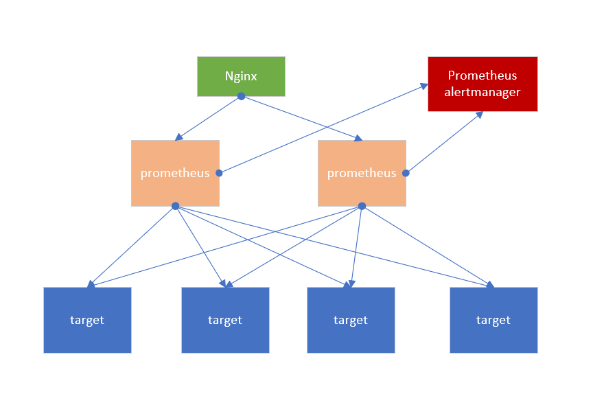
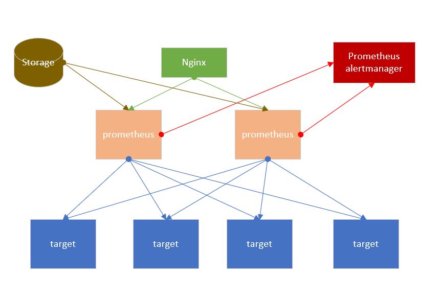
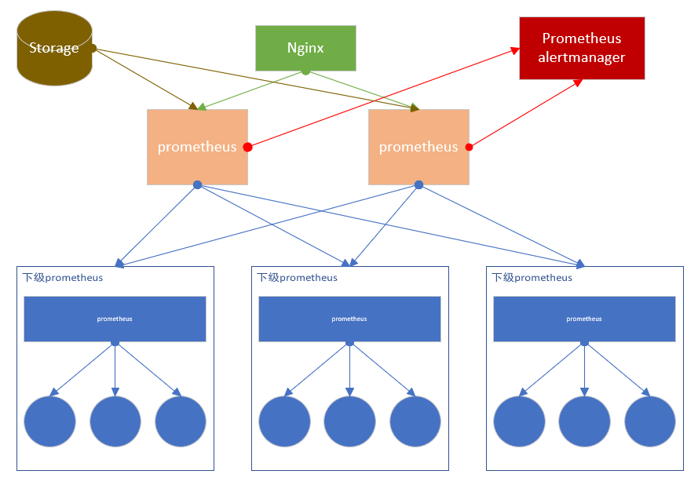
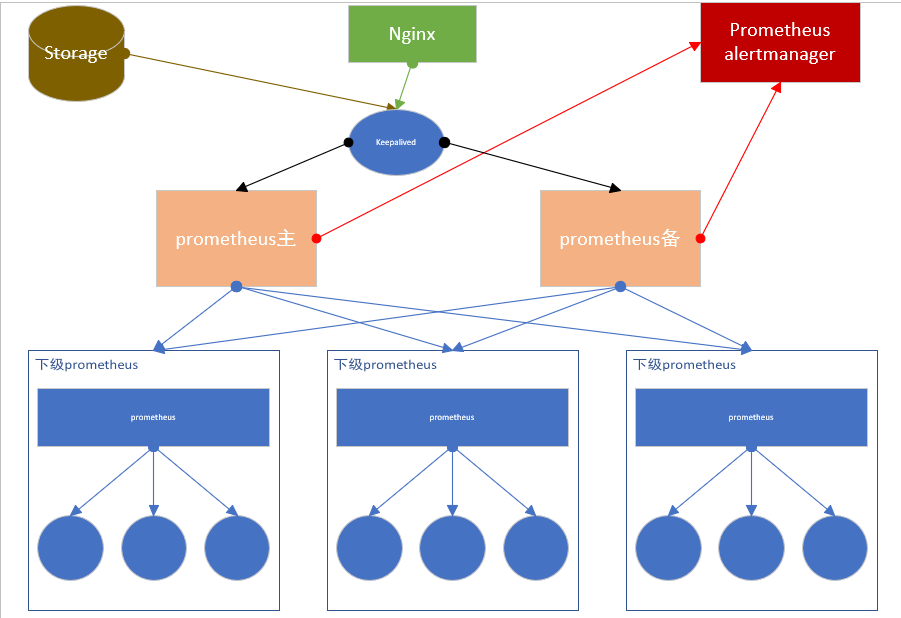

# prometheus常见HA架构

prometheus作为一个监控系统，在架构体系中，需要保证自身的稳定性和可用性。prometheus的单体架构可能存在单点故障，并且随着监控规模的扩展，大量的数据读写也会使单体架构的反应变慢，过度消耗系统资源，所以我们需要引入prometheus的高可用集群。本文介绍prometheus常见的三种HA架构，简单HA、简单HA+远端存储和简单HA+远端存储+联邦。

## 简单HA

简单HA如下图所示

简单HA使用多个配置一模一样的prometheus去采集相同的target,并使用一个负载均衡Nginx路由到任意一台prometheus，即使其中一台服务挂掉，仍然能保证prometheus的监控服务可用。prometheus alertmanager是prometheus自带的告警模块，将集群的多个prometheus的告警对接到一个告警模块。



这种架构就是比较简单的HA，只是部署多个一模一样的实例去干同一样的事，保证整个监控服务不会出现单点故障。但是虽然是多个一模一样的prometheus也会有出现数据一致性的问题。简单HA中各个prometheus的采集周期是一样的，但是开始采集的时间并不是固定的，并且加上不稳定的网络延时，所以就会造成各个prometheus之间的数据并不是完全一样的。
在稳定性方面也存在着问题，这种架构下，如果数据丢失的话是无法进行恢复的，如果prometheus实例经常迁移，或动态扩展，这个架构就没那么灵活。另外因为没有额外的远端存储，这种架构不足以支持prometheus存储大量或者长时间的数据。这种方案适合监控规模不大且不需要存储长期或大量数据的场景。
这种架构在一致性、存储容灾、迁移、动态扩展、远端存储的方面都存在问题。

## 简单HA+远端存储

简单HA+远端存储如下图

此种架构只是在简单HA的基础上加了个远程存储，通过使用prometheus自带的远程读写接口去对接诸如InfluxDB、OpenTSDB等第三方存储，将数据写入远程的存储库中。prometheus存储以及查询数据在合并本地数据后进行远程数据的处理，就解决了简单HA架构中存在的数据一致性、持久化、迁移性、扩展性问题。



但是，在开启远程存储后所需的内存可能会飙升3~4倍，prometheus的Commiter认为25%~35%的内存占用是比较正常的，有人建议将最大Shard数量减少到50来降低内存占有率。这是因为远程存储往往需要先把WAL中的数据写完，一般来说WAL会保存约2小时的数据，所以会启动很多进程，所以需要限制。

这种架构，能够满足一些中小型企业的监控需求，短期（如15天）内的监控数据可以从本地取，长期的数据从远程存储中获取，并且因为有了远程存储，prometheus迁移或者宕机重启可以很快进行数据恢复。

但是这个架构也还存在着一些问题，当监控规模较大时，prometheus有限的服务器节点在采集能力上有明显的瓶颈，海量的数据对于远端存储来说也有着巨大的挑战。prometheus远程存储比本地存储会占用更多的内存和CPU，此时可以通过减少label和采集间隔以降低资源占用，或者增大资源限制。


## 简单HA+远端存储+联邦集群

简单HA+远端存储+联邦集群 如下图所示

这个架构也是在上一个方案的基础上扩展来的，主要解决的就是单个prometheus的采集瓶颈的问题。联邦集群可以将监控采集任务以分治法的形式划分给不同的Prometheus实例分别处理，以实现功能分区，这种架构利于水平扩展。



这种联邦集群的架构方式大大提高了单个prometheus的采集能力和存储能力如图所示，最下面一级的Prometheus可以分别在分别在不同的区域、机房进行数据采集，上一级的prometheus作为联邦节点，负责定时从下级Prometheus节点获取数据并汇总。多个联邦节点大大保证了可用性。需要注意的是部分敏感报警尽量不要通过Global节点（上层节点，只负责收集和存储聚合数据）触发，毕竟从shard节点到Global节点传输链路的稳定性会影响到数据到达的效率，进而导致报警实效性降低。例如，服务UPDOWN状态、API请求异常这类报警我们都放在shard节点进行。

这种方案，主要在解决单个prometheus采集瓶颈的问题，降低了单个prometheus的采集压力，同时通过联邦节点汇聚主要数据，降低本地存储的存储压力，在避免单点故障方面也有不错的优势。

但是这种架构也有一定的问题,主要的问题有：
1. 每个集群部都部署一套独立的prometheus，在通过grafana等可视化工具查看每个集群的数据，缺乏统一的全局视图。
2. 配置比较复杂，需要对下层的prometheus，进行任务拆分，将不同的采集点，分别分配到下层每个prometheus上。
3. 需要比较完整的数据备份方案和历史数据存储方案以保证监控存储的高可用性
4. 缺少对历史数据的降准、采样能力
5. 面对监控数据海量洪峰，也要进行一系列优化
6. 数据一致性和准确性可能降低。下级节点会按照设定的间隔时间抓取目标，而上级节点要抓取下级节点的数据，这会导致到达主节点的数据出现延迟，从而导致数据倾斜和告警延迟。
7. 在使用过程中，根据经验，联邦对采集点大约会有5%的额外内存开销，实际使用过程中需要评估资源的使用量。

使用Prometheus联邦集群可以实现，prometheus监控prometheus，但需要遵循以下两点原则：
- 采用网络模式，在同一个数据中心每个prometheus都可以监控其他的prometheus
- 采用上下级模式，上一级的prometheus监控数据中心级别的prometheus

除此之外，为了避免下一级的prometheus的单点故障，可以部署多个prometheus节点，但是效率上会差很多，并且每个监控对象会被重复采集，数据也会被重复保存。

在联邦集群的主备架构中，通常采用keepalived的方式实现主备切换。Master节点获取各个采集层的prometheus数据，Slave节点不去查询数据；如果Master节点宕机了，会关闭本机的keepalived，VIP自动切换到Slave节点，同时去除Master节点中采集的Target相关设置，并且启动Slave节点采集Target的相关设置。



简单HA+远端存储+联邦集群这种方案，适合中大型企业，尤其是单数据中心，大数据量的采集任务或者是多数据中心的场景。相比之下可能采用thanos的方案更好一点。

## 监控集群优化

从部署方式入手的优化就是根据是应用场景的不同来选取最合适的架构方案，而从内部入手进行优化可以保证我们的系统内部也能做到最佳。
1. 尽早去除高纬度的数据。
	在以prometheus为代表的的指标监控系统中，有一个很重要的概念——Cardinality基数，他代表label的可能取值。正常来说，单实例的Cardinality基数值应该在10个左右。高纬度的数据也就是有很多个标签或标签值的指标，每新增一个Label值就等于在存储时创建了一个时间序列，如果Label值过多，即高纬度的数据，一方面会占据大量的存储空间，另一方面也会在聚合的时候消耗过量的资源。所以像Email地址，用户地址，IP地址等都不适合作为Label.
使用一些警告规则可以帮助你找出那些坏的高纬度指标，然后在Scrape配置里丢掉纬度过高的指标：
```yaml
# 统计每个指标的时间序列数，超出 10000 的报警
count by (__name__)({__name__=~".+"}) > 10000
```
2. 对于被监控的系统，一定要关注你最需要的20个以内的指标，最好不要对所有指标都要进行采集，可以对你采集点的系统进行指标梳理，整理出对你最有帮助的核心指标。
降低prometheus的采集指标的数据，是对prometheus集群部署时进行的最佳优化。
3. 运用合理且正确的PromQL。对不同的指标类型，使用相关函数的顺序要正确使用。
	