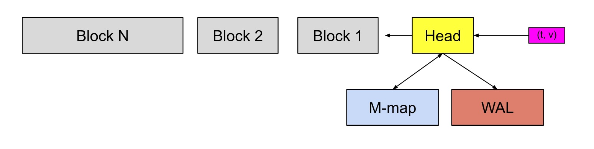
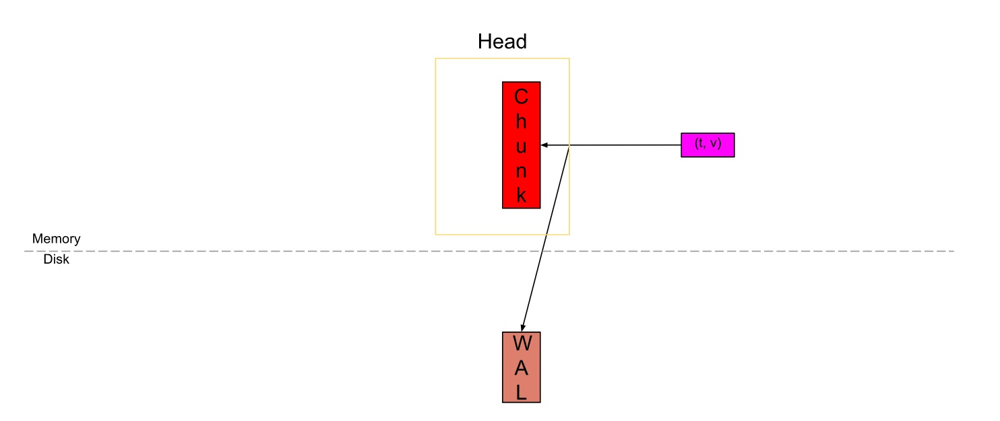
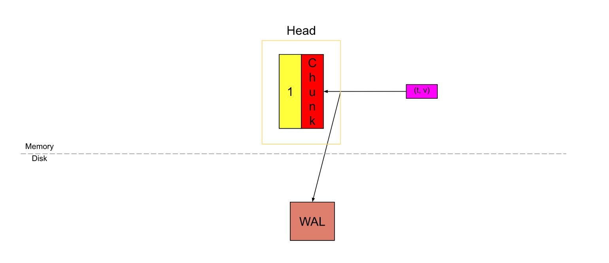
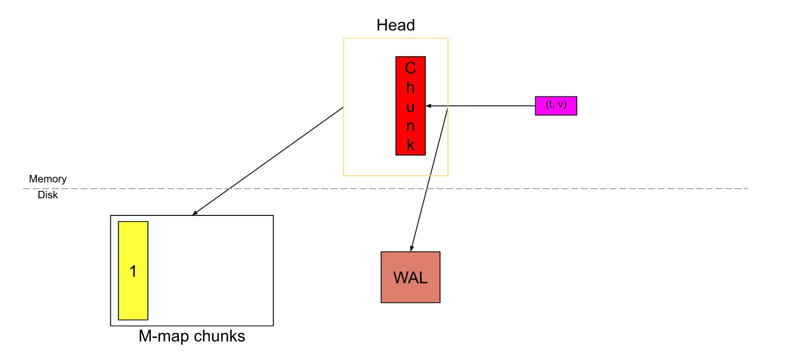
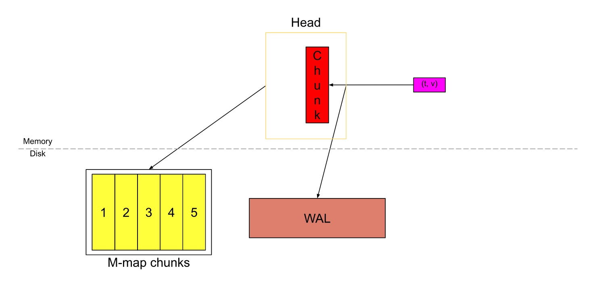
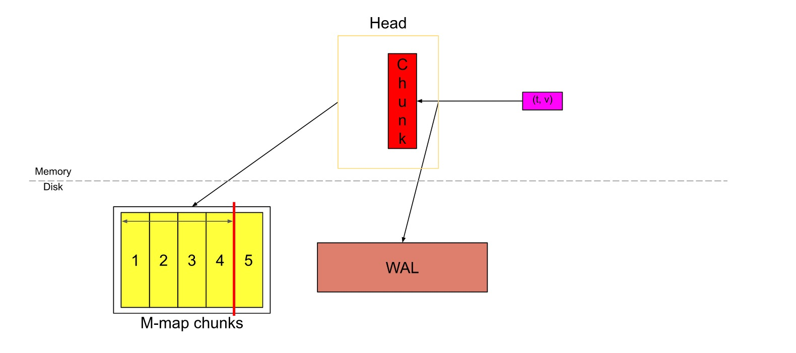
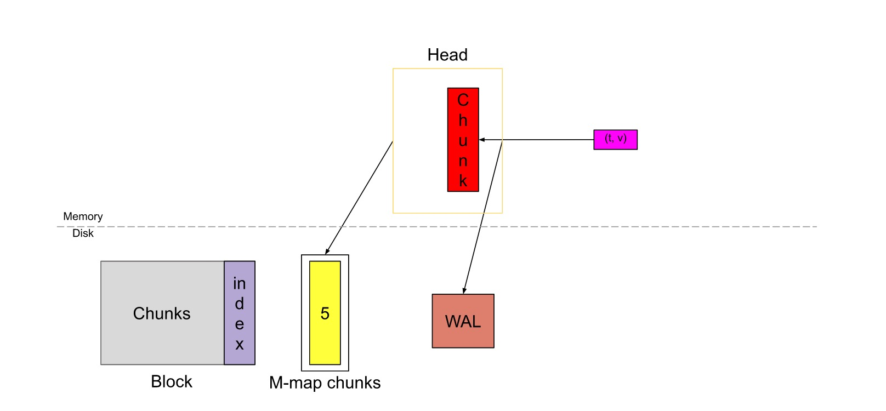
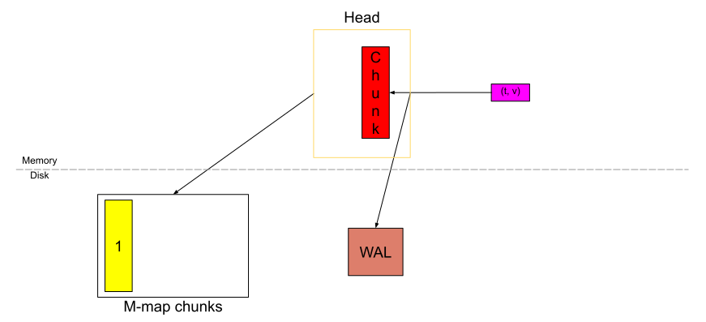

# 存储流向
## 本地存储
本地存储的目录如下所示：
```
./data
├── 01BKGV7JBM69T2G1BGBGM6KB12
│   └── meta.json
├── 01BKGTZQ1SYQJTR4PB43C8PD98
│   ├── chunks
│   │   └── 000001
│   ├── tombstones
│   ├── index
│   └── meta.json
├── 01BKGTZQ1HHWHV8FBJXW1Y3W0K
│   └── meta.json
├── 01BKGV7JC0RY8A6MACW02A2PJD
│   ├── chunks
│   │   └── 000001
│   │   └── 000002
│   ├── tombstones
│   ├── index
│   └── meta.json
├── 01BKGV7JC0RY8A6MACW02A2PJD.tmp
└── wal
    ├── 00000002
    └── checkpoint.000001
             └── 00000000
    └── checkpoint.000001.tmp
  
```

从大块的讲prometheus的存储分为两类，一个是block部分，就是01开头的那些文件夹，另一部分是WAL，就是指wal文件夹的部分

## block 块

在prometheus中每两个小时为一个时间窗口，即将2小时产生的数据存储在一个块里面，这样的块会有很多，监控数据会以时间段的形式被拆分成不同的block.
block会压缩，合并历史数据块，以及删除过期的块，随着压缩并会减少block的数量，在压缩过程中会发生三件事情，定期执行压缩，合并小的block到大的block以及清理过期的块。
block的大小不固定，根据设定的步长成倍数增长，默认最小的block保存两小时的监控数据，如果步长为4，那么block对应的时间一次为2h、8h、24h、72h。

##块内部结构
block内部格式如下：

```
├── 01EM6Q6A1YPX4G9TEB20J22B2R       # block
│   ├── chunks						 # 样本数据 每个大小为512MB超过会被截断成多个
│   │   └── 000001                   # 存储的时序数据
│   │   └── 000002                   # 存储的时序数据
│   ├── tombstones                   # 逻辑数据，主要记载删除记录，和标记要删除的内容，删除标记，可在查询块时排除样本。
│   ├── index                        # 索引文件，记录存储的数据的索引信息，通过文件内的几个表来查找时序数据
│   └── meta.json                    # block元数据信息，包含了样本数，最大时间和最小时间，压缩级别
```

一个块由4个部分组成

以01EM6Q6A1YPX4G9TEB20J22B2R块ID为例，以上是文件在磁盘上的外观
### block的命名原理 ULID
ULID：全局字典可排序ID
### 持久化的块
块具有一个有趣的属性，即其中的样本是不可变的。如果要添加更多样本，或删除一些样本，或更新一些样本，则必须使用所需的修改来重写整个块，并且新块具有新的ID。这两个块之间没有关系。我们通过墓碑对块进行了删除，而没有触及样本，因为在每个删除请求上重写一个块听起来并不健全
如下图所示，灰色部分的就是持久化在本地硬盘里面的不可变的块。上面的目录结构展示了一个块文件内部的结构。
- chunks
chunk用于保存压缩后的时序数据，每个chunk的大小被设计成


block在两个位置都有，硬盘和内存里面，如图



如图所示，黄色的部分叫做 head block,保存在内存里面，用来存储最新的数据，每个block初始都被设定为保留两个小时的数据，包括head block,不同的是，其他block是存储在硬盘上不可变的，而head block存在内存里，可以被修改不断增长，（t,v）代表着prometheus刮擦的数据，数据会先放在内存里面的head block,当head block的数据存储量达到2h的1.5倍即3h的数据时，他将被重新分配为2h和1h部分，2h数据的部分，会落盘，固定为不可变的block 1存储在硬盘里。剩下的1h数据部分的继续在内存里作为head_block继续被添加上新的数据，直到下个循环。

# Head 块

在上图中，Head块是数据库的内存部分，灰色块是磁盘上不可更改的持久块。我们有一个预写日志（WAL）用于持久写入。传入的sample（粉红色的方框）首先进入Head块，并在内存中停留一段时间，然后刷新到磁盘并映射到内存（蓝色的方框）。当这些内存映射的块或内存中的块变旧到一定程度时，它们会作为持久性块被刷新到磁盘。随着它们变旧，将合并更多的块，并在超过保留期限后将其最终删除。

在prometheus 2.19的版本，增加了 head块的内存映射M-map的数据格式，减少了内存的使用量

如下图所示
将head_block的部分进一步细化了来说,就是把内存中的head_block进一步分为多个chunk，更细颗粒度的将数据落盘。

prometheus刮擦的数据首先会被存储在位于内存里面的head_block的"active chunk"，这个active chunk是唯一可以主动写入数据的单元。

在数据写入active chunk的同时，也会将其记录到位于磁盘的预写日志 wal中，以确保持久性，当Prometheus意外停止后，可以从wal中恢复数据，不至于造成数据丢失。


一旦chunk填满，默认120个sample（一次刮擦的数据），或是到 了chunk/block 范围，默认为chunkRange（每个块保存数据的大小，默认情况下为2h），则将剪切一个新chunk，并称旧块为“full”。如果将scrape间隔为15秒，因此120个sample（完整块）将跨越30m。

黄色数字为1的块是已填充的完整chunk，红色块是已创建的新chunk。


从Prometheus v2.19.0开始，prometheus引入了内存映射，将head_block中已填充的完整的chunk，刷新到磁盘并从磁盘进行内存映射，同时仅将引用存储在内存中。通过内存映射，可以在需要时使用该引用将chunk动态加载到内存中。这是操作系统提供的功能。通过引入内存映射，减少了prometheus的内存消耗，虽然填充完毕的chunk会被刷到磁盘上，但是对于该部分的操作预写入日志不会被删除，直到该chunk所属的block完整落盘


以此类推，同样，随着新sample的不断涌入，新的chunk也被切割，然后将它们刷新到磁盘并映射到内存。

一段时间后，“ Head”块将如下所示。如果我们认为红色chunk几乎已满，则Head中有3h的数据（6个chunk，每个块跨越30m）。也就是chunkRange * 3/2。




当Head中的数据跨过chunkRange * 3/2时，数据的第一个chunkRange（此处为2h）被压缩为一个持久块。如果您在上面注意到，WAL此时将被截断并创建一个“检查点”（图中未显示）。此时head_block就会被切割成两部分，一部分是2h的数据，此部分会被压缩成一个不可变的block存储在硬盘里，同时此部分位于wal文件夹下的的操作事件日志会被删除，以及此部分的内存映射也会被删除，另一部分数据会继续重复之前在head_block发生过的事情，一部分被刷新到硬盘中，一部分存储在内存中等待数据被添加。

Sample的scrape，内存映射，压缩以形成持久性块的这一循环继续进行。这就形成了Head块的基本功能。

对于head_block的index文件，它在内存中并存储为倒排索引。有关该索引的总体概念的更多信息，请参见Fabian的博客文章。当Head块的压缩发生时，创建了一个持久性块，Head块被截断以删除旧的块，并且对该索引进行了垃圾回收，以删除Head中不再存在的任何系列条目。

如果TSDB必须重新启动（优雅地或突然地），它将使用磁盘上内存映射的块和WAL重播数据和事件，并重新构建内存中的索引和块。


# wal和checkpoint

## 介绍

在TSDB博客系列的第1部分中，我提到为了持久性，我们首先将传入的sample写到预写日志（WAL）中，并且当该WAL被截断时，将创建一个检查点。在此博客文章中，我们将简要讨论WAL的基础知识，然后深入探讨如何在Prometheus的TSDB中设计WAL和检查点。

## WAL基础

WAL是数据库中发生的事件的顺序日志。在写入/修改/删除数据库中的数据之前，首先将事件记录（附加）到WAL中，然后在数据库中执行必要的操作。

不管出于何种原因，如果机器或程序崩溃，都会在此WAL中记录事件，您可以按照相同的顺序重播这些事件以恢复数据。这对于内存数据库尤其有用，在内存数据库中，如果数据库崩溃，则如果不是WAL，则内存中的所有数据都会丢失。

这在关系数据库中被广泛使用，以为数据库提供持久性（[ACID](https://en.wikipedia.org/wiki/ACID)中的D）。同样，普罗米修斯（Prometheus）通过WAL，为其Head block提供可用性。 Prometheus还使用WAL进行正常重启以恢复内存中状态。

在Prometheus中，WAL仅用于记录事件并在启动时恢复内存中状态。它不以任何其他方式涉及读取或写入操作。

## 在Prometheus TSDB中写入WAL

### Records类型(记录类型)

series是prometheus数据库矩阵模型中的纵坐标，横坐标是64bit时间戳。

prometheus存储是基于Bigtable设计成key,value的形式存储，key是指标名称+一系列标签+时间戳，value则是64bit的值。

series指的是一个指标加上一组指标例如：

error_http_request{url="/",methond="GET"}，这就是一个series

sample：样本指的是一个时间序列加上时间戳和值


TSDB中的写请求由 [series](https://prometheus.io/docs/concepts/data_model/) 的标签值及其对应的sample组成。这给了我们两种记录类型，[series](https://prometheus.io/docs/concepts/data_model/) 和sample。

S[eries](https://prometheus.io/docs/concepts/data_model/) 记录由写请求中所有[series](https://prometheus.io/docs/concepts/data_model/)的标签值组成。[series](https://prometheus.io/docs/concepts/data_model/) 的创建产生一个唯一的引用，可用于查找该 [series](https://prometheus.io/docs/concepts/data_model/)。因此，“sample”记录包含相应[series](https://prometheus.io/docs/concepts/data_model/)的引用以及在写入请求中属于该[series](https://prometheus.io/docs/concepts/data_model/)的sample列表。

最后一种记录类型是用于删除请求的`Tombstones`。它包含已删除的引用以及要删除的时间范围。

### 写

对于包含sample的所有写请求，都会写入“sample”记录。当我们第一次看到该series记录时，该series记录仅写入一次（因此在“Head”中创建）。

如果写请求包含一个新series，则“series”记录总是写在“sample”记录之前，否则在重放期间，如果“sample”记录位于“series”之前，则“sample”记录中的系列引用将不会指向任何series。

在Head中创建series后，将series记录写入，以将引用也存储在记录中，而在将sample添加到Head中之前，编写“sample”记录。

通过将同一记录中的所有不同时间序列（和不同时间序列的sample）分组，每个写入请求仅写入一个series和sample记录。如果请求中所有sample的序列已存在于Head中，则仅将sample记录写入WAL。

收到删除请求后，我们不会立即将其从内存中删除。我们存储了一个称为“Tombstones”的东西，它表示已删除的系列和删除的时间范围。在处理删除请求之前，我们将逻辑删除记录写入WAL。

### 在磁盘上的格式

默认情况下，WAL存储为带有128MiB的编号文件序列。这里的WAL文件称为“segment”。

```text
data
└── wal
   ├── 000000
   ├── 000001
   └── 000002
```

文件的大小必然会使旧文件的垃圾回收更加简单。可以猜到，序列号总是增加的。

## WAL截断和检查点

我们需要定期删除旧的WAL段，否则，磁盘最终将填满，TSDB的启动将花费大量时间，因为它必须重播此WAL中的所有事件（其中大部分会被丢弃，因为旧）。

### WAL截断

WAL截断在Head块被截断之后立即完成（有关Head截断的信息，请参见第1部分）。无法随意删除文件，并且删除操作会针对前N个文件进行，而不会在序列中造成间隔。

由于写请求可以是随机的，因此在不遍历所有记录的情况下确定WAL段中样本的时间范围既不容易也不高效。因此，我们删除了片段的前2/3。

```text
data
└── wal
   ├── 000000
   ├── 000001
   ├── 000002
   ├── 000003
   ├── 000004
   └── 000005
```

在上面的示例中，文件000000 000001 000002 000003将被删除。

这里有一个陷阱：series记录仅写入一次，因此，如果盲目删除WAL段，则会丢失这些记录，因此无法在启动时恢复这些series。另外，在前2/3段中可能还没有从头上截断一些sample，因此您也会丢失它们。

### 检查点

在截断WAL之前，我们从那些要删除的WAL段中创建一个“检查点”。您可以将检查点视为经过过滤的WAL。考虑时间T之前的数据是否发生Head截断，以上述WAL布局为例，检查点操作将按顺序遍历000000 000001 000002 000003中的所有记录，并且：

- 删除不再在Head中的series的所有series记录。
- 删除时间T之前的所有sample。
- 删除T之前时间范围内的所有逻辑删除记录。
- 保留与在WAL中找到的series，sample和墓碑记录相同的方式（以它们在WAL中出现的顺序）。

删除操作也可以是重写操作，同时从记录中删除不必要的项目（因为单个记录可以包含多个series，sample或逻辑删除）。

这样，您就不会丢失仍在Head的series，sample和墓碑。该检查点名为checkpoint.X，其中X是在其上创建检查点的最后一个段号（此处为00003；您将在下一节中知道为什么这样做）。

在WAL截断和检查点之后，磁盘上的文件看起来像这样（检查点看起来又是另一个WAL）：

```text
data
└── wal
   ├── checkpoint.000003
   |   ├── 000000
   |   └── 000001
   ├── 000004
   └── 000005
```

如果有任何较旧的检查点，则此时将其删除。

## WAL重播

我们首先从最后一个检查点开始依次遍历记录（与它关联的最大数字的检查点是最后一个检查点）。对于checkpoint.X，X告诉我们需要从哪个WAL段继续重放，即X + 1。因此，在上面的示例中，在重播checkpoint.000003之后，我们从WAL段000004继续重播。

您可能会想为什么在删除WAL段之前，为什么我们需要在检查点中跟踪段号。关键是，创建检查点和删除WAL段不是原子的。在两者之间可能发生任何事情，并防止WAL段删除。因此，我们将不得不重播将被删除的WAL片段的另外2/3，从而使重播速度变慢。

在谈论单个记录时，将对它们执行以下操作：

- `Series`：使用与记录中提到的相同的引用在Head中创建series（以便我们以后可以匹配sample）。普罗米修斯可以通过映射参考来处理同一series的多个series记录。
- `Sample`：将此记录中的sample添加到Head。记录中的引用指示要添加的series。如果找不到引用series，则跳过该sample。
- `Tombstones`：通过使用引用来标识series，将这些Tombstones存储回Head。

## 读写WAL的底层细节

当大量写入请求时，您要避免随机写入磁盘，以避免写入放大。此外，在读取记录时，您要确保它没有损坏（在突然关闭或磁盘故障时很容易发生）。

Prometheus具有WAL的实现，其中一条记录只是一个字节切片，而调用者必须负责对记录进行编码。为了解决以上两个问题，WAL软件包执行以下操作：

- 数据一次一页地写入磁盘。一页长32KiB。如果记录大于32KiB，则将其分解成较小的块，每块接收一个WAL记录头，以便进行簿记，以了解该块是记录的结尾，开始还是在中间。
- 记录的校验和将附加在末尾，以检测读取时的任何损坏。

WAL软件包负责无缝地连接记录片段，并在遍历记录以进行重放时检查记录的校验和。

默认情况下，WAL记录不进行重压缩（或完全压缩）。因此，WAL软件包提供了使用Snappy（现在默认启用）压缩记录的选项。此信息存储在WAL记录头中，因此，如果计划启用或禁用压缩，则压缩和未压缩的记录可以一起存在。

## 代码

`tsdb/wal/wal.go`中提供了WAL实现，该实现将记录作为字节的片并进行低级别的磁盘交互。该文件的实现既可以写入字节记录，也可以迭代记录（再次作为字节的切片）。

`tsdb/record/record.go`包含各种记录及其编码和解码逻辑。

`tsdb/wal/checkpoint.go`中存在检查点逻辑。

`tsdb/head.go`包含其余的内容：

- 创建和编码记录并调用WAL写。
- 调用检查点和WAL截断。
- 重放WAL记录，对其进行解码并恢复内存中状态。

# 磁盘Head Chunks的内存映射

## 简介

在TSDB博客系列的第1部分中，我提到一旦chunk“已满”，就将其刷新到磁盘和映射的内存中。这有助于减少Head块的内存占用，并有助于加快我们在第2部分中讨论的WAL重播。在本博文中，我们将更深入地探讨Prometheus中的WAL设计方式。

由于这是我编写的Prometheus TSDB博客系列的一部分，建议您阅读第1部分，以了解这些内存映射块在TSDB（或Head块）中的位置，第2部分了解WAL重播。

## 写 chunks

从第1部分重新开始，当一个chunk已满时，我们剪切了一个新chunk，而较旧的chunk变得不可变，只能从中读取（下面的黄色块）。


而不是将其存储在内存中，我们将其刷新到磁盘并存储引用以供以后访问。



此刷新的chunk是磁盘中的内存映射chunk。不变性是最重要的因素，否则对于每个sample而言，重写压缩chunk的效率都太低。

## 在磁盘上的格式

该格式也可以在[GitHub](https://github.com/prometheus/prometheus/blob/master/tsdb/docs/format/head_chunks.md)上找到。

### File

这些chunks保留在其自己的目录中，称为`chunks_head`，其文件序列类似于WAL（除了以1开头）。例如：

```text
data
├── chunks_head
|   ├── 000001
|   └── 000002
└── wal
    ├── checkpoint.000003
    |   ├── 000000
    |   └── 000001
    ├── 000004
    └── 000005
```

文件的最大大小保持为128MiB。现在深入研究单个文件，该文件包含8B标头。

```text
┌──────────────────────────────┐
│  magic(0x0130BC91) <4 byte>  │
├──────────────────────────────┤
│    version(1) <1 byte>       │
├──────────────────────────────┤
│    padding(0) <3 byte>       │
├──────────────────────────────┤
│ ┌──────────────────────────┐ │
│ │         Chunk 1          │ │
│ ├──────────────────────────┤ │
│ │          ...             │ │
│ ├──────────────────────────┤ │
│ │         Chunk N          │ │
│ └──────────────────────────┘ │
└──────────────────────────────┘
```

`Magic Number`是可以唯一地将文件标识为内存映射的head chunk文件的任何数字。在实现此功能时，我将其设置为我的生日：）。`Chunk Format`告诉我们如何解码文件中的chunk。额外的填充是为了允许我们将来可能需要的任何head文件选项。

在文件头之后，是chunks。

### Chunks

一个大chunk看起来像这样:

```text
┌─────────────────────┬───────────────────────┬───────────────────────┬───────────────────┬───────────────┬──────────────┬────────────────┐
| series ref <8 byte> | mint <8 byte, uint64> | maxt <8 byte, uint64> | encoding <1 byte> | len <uvarint> | data <bytes> │ CRC32 <4 byte> │
└─────────────────────┴───────────────────────┴───────────────────────┴───────────────────┴───────────────┴──────────────┴────────────────┘
```

`series ref`与我们在第2部分中讨论的系列引用相同，它是用于访问内存中系列的系列ID。 `mint`和`maxt`是在chunk sample中看到的最小和最大时间戳。`encoding`是用于压缩块的编码。 `len`是此后的字节数，`data`是压缩块的实际字节数。

`CRC32`是上述chunk内容的校验和，用于检查数据的完整性。

## 读 chunks

对于每个chunk，Head块都会将该chunk的mint和maxt以及引用存储在内存中以对其进行访问。

引用长度为8个字节。前4个字节指示chunk所在的文件编号，后4个字节指示chunk起始位置的文件偏移量（即系列ref的第一个字节）。如果该chunk位于文件00093中，并且series ref从文件中的字节偏移量1234开始，则该chunk的引用将为（93 << 32）|。 1234（左移位，然后按位或）。

我们将mint和maxt存储在Head中，以便我们可以选择chunk而不必查看磁盘。当我们必须访问chunk时，我们仅使用引用访问编码和chunk数据。

在代码中，文件看起来像又一个字节切片（每个文件一个切片），并在某个索引处访问该切片以获取chunk数据，而OS将内存中的切片映射到磁盘。磁盘的内存映射是一项操作系统功能，仅将磁盘的一部分读取到正在访问的内存中，而不是整个文件。

## 在启动时重播

在第2部分中，我们讨论了WAL重播，其中重播每个单独的sample以重新创建压缩块。现在，我们已经在磁盘上压缩了完整的chunks，我们不需要重新创建这些chunks，而仍然需要从WAL创建不完整的chunks。现在，使用磁盘中的这些内存映射chunks，可以按以下方式进行重播。

在启动时，首先我们遍历`chunks_head`目录中的所有chunks，并在内存中构建series ref(chunk引用列表以及属于该series引用的mint和maxt的映射)。

然后，我们继续进行第2部分中所述的WAL重播，但进行少量修改：

- 当我们遇到“series”记录时，在创建series之后，我们在上图中查找该series的引用，并且如果存在任何内存映射chunks，则将该列表附加到该series中。
- 当我们遇到“sample”记录时，如果该sample的相应chunks具有任何内存映射的chunk，并且该sample属于其涵盖的时间范围，那么我们将跳过该sample。如果不是，那么我们将sample提取到Head块中。

## 增强功能

这种额外的复杂性有什么用，而我们却可以避免将chunk存储在内存和WAL中了？该功能是在2020年最近添加的，因此让我们看看它带来了什么。

### 节省内存

如果必须将chunk存储在内存中，则它可能需要120到200字节之间的任意空间（甚至更多，具体取决于sample的可压缩性）。现在，将其替换为24个字节-chunk引用，最小时间和最大时间各8个字节。

虽然这听起来像是减少80-90％的内存，但实际情况却有所不同。 Head还需要存储更多东西，例如内存索引，所有符号（标签值）等，以及占用一些内存的TSDB的其他部分。

在现实世界中，我们可以看到内存占用量减少了15-50％，具体取决于抓取sample的速率和创建新series的速率。要注意的另一件事是，如果您正在运行一些查询，这些查询涉及磁盘上的许多这些chunk，则需要将它们加载到要处理的内存中。因此，这并不是绝对减少峰值内存使用量。

### 快速启动

WAL重播是启动最慢的部分。主要是，（1）从磁盘解码WAL记录和（2）从各个sample重建压缩chunk是重放的缓慢部分。内存映射chunks的迭代相对较快。

我们无法避免对记录进行解码，因为我们需要检查所有记录。如您在上面的重放中所见，我们正在跳过内存映射chunks范围内的samples。在这里，我们避免重新创建那些完全压缩的chunk，从而节省了重放时间。可以将启动时间减少15-30％。

## 垃圾回收

内存中的垃圾回收发生在Head截断期间，在该截断期间，它只是丢弃了比截断时间T更早的chunk的引用。但是文件仍然存在于磁盘上。与WAL段一样，我们还需要定期删除旧的m映射文件。

对于每个内存映射的chunk文件，我们将文件中所有chunks中的绝对最大时间存储在内存中。对于实时文件（当前正在其中写入chunk的文件），我们在添加新chunk时会更新内存中的最大时间。在重新启动期间，当我们迭代所有内存映射的chunk时，我们将恢复内存中文件的最大时间。

因此，当时间T之前的数据发生Head截断时，我们在时间T上对这些文件调用截断。最大时间低于T的文件（实时文件除外）在此时保留顺序（如果文件已删除）是5、6、7、8，并且如果文件5和7在时间T之后，则仅删除5，其余序列为6、7、8）。

截断后，我们关闭实时文件并开始一个新文件，因为在小容量和小设置的情况下，可能需要很多时间才能达到文件的最大大小。因此，在此处rotate文件将有助于在下一次截断期间删除旧chunk。

# 持久块及其索引

在[第1部分](https://ganeshvernekar.com/blog/prometheus-tsdb-the-head-block/)，[第2部分](https://ganeshvernekar.com/blog/prometheus-tsdb-wal-and-checkpoint/)和[第3部分中](https://ganeshvernekar.com/blog/prometheus-tsdb-mmapping-head-chunks-from-disk/)，我们介绍了与Head（内存中）块相关的大多数内容（即，在撰写本文时，Head中有更多内容）。在此博客文章中，我们将更深入地研究驻留在磁盘上的持久性块。

这里有很多信息要消化，所以请坐下来放松一下，也许可以喝杯咖啡。

## 什么是持久的块时，它什么时候创建[＃](https://ganeshvernekar.com/blog/prometheus-tsdb-persistent-block-and-its-index/#whats-a-persistent-block-and-when-is-it-created)

磁盘上的一个块是在固定时间范围内由其自己的索引组成的块的集合。这是一个其中包含多个文件的目录。每个块都有一个唯一的ID，这是一个[全球唯一的按词典顺序可排序的标识符（ULID）](https://github.com/oklog/ulid)。

块具有一个有趣的特性，即其中的样本是不可变的。如果要添加更多样本，或删除一些样本，或更新一些样本，则必须使用所需的修改来重写整个块，并且新块具有新的ID。这两个块之间没有关系。我们通过墓碑对块进行了删除，而没有触及样本，因为在每个删除请求上重写一个块听起来并不健全。我们将在此博客文章中讨论更多有关它的内容。

我们在[第1部分中](https://ganeshvernekar.com/blog/prometheus-tsdb-the-head-block/)看到，当Head块填充了`chunkRange*3/2`时间上不等的数据时，我们将获取第`chunkRange`一个数据并转换为持久性块。


在这里，我们称其`chunkRange`为`blockRange`块的上下文，`2h`默认情况下，在Prometheus中从“头”切出的第一个块为跨度。

看下面的TSDB的总体情况


当这些块变旧时，多个块将被压缩（或合并）以形成一个更大的新块，而旧块则被删除。因此，我们有两种从头和现有块创建块的方法。我们将在以后的博客文章中讨论压缩。

## 块内容[＃](https://ganeshvernekar.com/blog/prometheus-tsdb-persistent-block-and-its-index/#contents-of-a-block)

一个块由4个部分组成

1. `meta.json` （文件）：块的元数据。
2. `chunks` （目录）：包含原始数据块，但不包含有关数据块的任何元数据。
3. `index` （文件）：此块的索引。
4. `tombstones` （文件）：删除标记，可在查询块时排除样本。

以`01EM6Q6A1YPX4G9TEB20J22B2R`块ID为例，以下是文件在磁盘上的外观


数据
```
data
├── 01EM6Q6A1YPX4G9TEB20J22B2R
|   ├── chunks
|   |   ├── 000001
|   |   └── 000002
|   ├── index
|   ├── meta.json
|   └── tombstones
├── chunks_head
|   ├── 000001
|   └── 000002
└── wal
    ├── checkpoint.000003
    |   ├── 000000
    |   └── 000001
    ├── 000004
    └── 000005
```

让我们更深入地研究它们中的每一个。

------

### 1. `meta.json`[＃](https://ganeshvernekar.com/blog/prometheus-tsdb-persistent-block-and-its-index/#1-metajson)

它包含整个块所需的所有元数据。这是一个例子：


```json
{
    "ulid": "01EM6Q6A1YPX4G9TEB20J22B2R",
    "minTime": 1602237600000,
    "maxTime": 1602244800000,
    "stats": {
        "numSamples": 553673232,
        "numSeries": 1346066,
        "numChunks": 4440437
    },
    "compaction": {
        "level": 1,
        "sources": [
            "01EM65SHSX4VARXBBHBF0M0FDS",
            "01EM6GAJSYWSQQRDY782EA5ZPN"
        ]
    },
    "version": 1
}
```

`version` 告诉我们如何解析元文件。

虽然目录名设置为ULID，只在一本`meta.json`为`ulid`是有效ID，目录名可以是任何东西。

`minTime`并且`maxTime`是该块中存在的所有块中的绝对最小和最大时间戳。

`stats` 告诉块中存在的系列，样本和块的数量。

`compaction`讲述块的历史。`level`告诉您已经看到了多少代了。`sources`告诉该块是从哪个块创建的（即，合并了哪些块以形成此块）。如果是从Head块创建的，则将其`sources`设置为自身（`01EM6Q6A1YPX4G9TEB20J22B2R`在这种情况下）。

------

### 2. `chunks`[＃](https://ganeshvernekar.com/blog/prometheus-tsdb-persistent-block-and-its-index/#2-chunks)

该`chunks`目录包含一系列编号文件，类似于WAL /检查点/头文件。每个文件的上限为512MiB。这是此目录中单个文件的格式：
```
┌──────────────────────────────┐
│  magic(0x85BD40DD) <4 byte>  │
├──────────────────────────────┤
│    version(1) <1 byte>       │
├──────────────────────────────┤
│    padding(0) <3 byte>       │
├──────────────────────────────┤
│ ┌──────────────────────────┐ │
│ │         Chunk 1          │ │
│ ├──────────────────────────┤ │
│ │          ...             │ │
│ ├──────────────────────────┤ │
│ │         Chunk N          │ │
│ └──────────────────────────┘ │
└──────────────────────────────┘
```

它看起来与[内存映射的头块文件](https://ganeshvernekar.com/blog/prometheus-tsdb-mmapping-head-chunks-from-disk/#the-file)非常相似。该`magic`数字将该文件标识为块文件。`version`告诉我们如何解析此文件。`padding`适用于将来的任何标头。然后是一个大块列表。

这是单个块的格式：
```
┌───────────────┬───────────────────┬──────────────┬────────────────┐
│ len <uvarint> │ encoding <1 byte> │ data <bytes> │ CRC32 <4 byte> │
└───────────────┴───────────────────┴──────────────┴────────────────┘
```

这又类似于[磁盘上的内存映射的头块](https://ganeshvernekar.com/blog/prometheus-tsdb-mmapping-head-chunks-from-disk/#chunks)，除了它缺少`series ref`，`mint`和`maxt`。我们需要Head块的这些附加信息来在启动期间重新创建内存索引。但是，对于块而言，我们在中具有此附加信息`index`，因为索引是它最终所属的位置，因此我们在这里不需要它。

要访问这些块，我们再次需要在[第3部分中](https://ganeshvernekar.com/blog/prometheus-tsdb-mmapping-head-chunks-from-disk/)讨论过的块引用。重复我刚才说的内容：参考长度为8个字节。前4个字节告诉文件块所在的文件号，后4个字节告诉文件文件块开始的偏移量（即的第一个字节`len`）。如果该块位于文件中`00093`，`len`而该块的起始于`1234`文件中的字节偏移，则该块的引用为`(92 << 32) | 1234`（左移位，然后按位或）。文件名使用基于1的索引，而块引用使用基于0的索引。因此在计算块引用时`00093`转换为`92`。

这是该格式上游文档的[链接](https://github.com/prometheus/prometheus/blob/master/tsdb/docs/format/chunks.md)`chunks`。

------

### 3. `index`[＃](https://ganeshvernekar.com/blog/prometheus-tsdb-persistent-block-and-its-index/#3-index)

索引包含查询该块数据所需的所有内容。它不与任何其他块或外部实体共享任何数据，这使得可以在没有任何依赖性的情况下读取/查询该块。

索引是“倒排索引”，也广泛用于索引文档。Fabian在[他的博客文章中](https://fabxc.org/tsdb/)讨论了更多有关倒排索引的[信息](https://fabxc.org/tsdb/)，因此，由于这篇文章已经太久了，因此我在这里跳过了该主题。

这是该指数的高级视图，我们将在短期内深入探讨。

```
┌────────────────────────────┬─────────────────────┐
│ magic(0xBAAAD700) <4b>     │ version(1) <1 byte> │
├────────────────────────────┴─────────────────────┤
│ ┌──────────────────────────────────────────────┐ │
│ │                 Symbol Table                 │ │
│ ├──────────────────────────────────────────────┤ │
│ │                    Series                    │ │
│ ├──────────────────────────────────────────────┤ │
│ │                 Label Index 1                │ │
│ ├──────────────────────────────────────────────┤ │
│ │                      ...                     │ │
│ ├──────────────────────────────────────────────┤ │
│ │                 Label Index N                │ │
│ ├──────────────────────────────────────────────┤ │
│ │                   Postings 1                 │ │
│ ├──────────────────────────────────────────────┤ │
│ │                      ...                     │ │
│ ├──────────────────────────────────────────────┤ │
│ │                   Postings N                 │ │
│ ├──────────────────────────────────────────────┤ │
│ │              Label Offset Table              │ │
│ ├──────────────────────────────────────────────┤ │
│ │             Postings Offset Table            │ │
│ ├──────────────────────────────────────────────┤ │
│ │                      TOC                     │ │
│ └──────────────────────────────────────────────┘ │
└──────────────────────────────────────────────────┘
```

与其他文件相同，该`magic`数字将该文件标识为索引文件。`version`告诉我们如何解析此文件。该索引的入口点是`TOC`，它表示目录。因此，我们首先将从`TOC`索引的其他部分开始学习。

------

#### A. `TOC`[＃](https://ganeshvernekar.com/blog/prometheus-tsdb-persistent-block-and-its-index/#a-toc)

```
┌─────────────────────────────────────────┐
│ ref(symbols) <8b>                       │ -> Symbol Table
├─────────────────────────────────────────┤
│ ref(series) <8b>                        │ -> Series
├─────────────────────────────────────────┤
│ ref(label indices start) <8b>           │ -> Label Index 1
├─────────────────────────────────────────┤
│ ref(label offset table) <8b>            │ -> Label Offset Table
├─────────────────────────────────────────┤
│ ref(postings start) <8b>                │ -> Postings 1
├─────────────────────────────────────────┤
│ ref(postings offset table) <8b>         │ -> Postings Offset Table
├─────────────────────────────────────────┤
│ CRC32 <4b>                              │
└─────────────────────────────────────────┘
```

它告诉我们索引的各个部分到底从哪里开始（文件中的字节偏移量）。我已经在上面的索引格式中标记了每个参考点要做什么。下一个组件的起点还告诉我们各个组件在何处结束。如果任何引用为`0`，则表明索引中不存在相应的部分，因此在读取时应将其跳过。

由于`TOC`是固定大小，因此文件的最后52个字节可以用作`TOC`。

正如您将在接下来的部分中注意到的那样，每个组件都有自己的校验和，即`CRC32`检查基础数据的完整性。

------

#### B. `Symbol Table`[＃](https://ganeshvernekar.com/blog/prometheus-tsdb-persistent-block-and-its-index/#b-symbol-table)

本节包含在此块中所有系列的标签对中找到的重复数据删除字符串的排序列表。例如，如果系列为`{a="y", x="b"}`，则符号为`"a", "b", "x", "y"`。


```
┌────────────────────┬─────────────────────┐
│ len <4b>           │ #symbols <4b>       │
├────────────────────┴─────────────────────┤
│ ┌──────────────────────┬───────────────┐ │
│ │ len(str_1) <uvarint> │ str_1 <bytes> │ │
│ ├──────────────────────┴───────────────┤ │
│ │                . . .                 │ │
│ ├──────────────────────┬───────────────┤ │
│ │ len(str_n) <uvarint> │ str_n <bytes> │ │
│ └──────────────────────┴───────────────┘ │
├──────────────────────────────────────────┤
│ CRC32 <4b>                               │
└──────────────────────────────────────────┘
```

的`len <4b>`是在此部分的字节数和`#symbols`是符号的数目。它后面跟着`#symbols`utf-8编码的字符串数，其中每个字符串都有其长度前缀，后跟该字符串的原始字节。校验和（`CRC32`）的完整性。

索引中的其他部分可以为任何字符串引用此符号表，因此可以大大减小索引的大小。符号在文件中开头的字节偏移量（即的开头`len(str_i)`）形成了对应符号的引用，该符号可以在其他位置使用，而不是实际的字符串。当您需要实际的字符串时，可以使用偏移量从此表中获取它。

------

#### C. `Series`[＃](https://ganeshvernekar.com/blog/prometheus-tsdb-persistent-block-and-its-index/#c-series)

本节包含此块中存在的所有系列信息的列表。该系列按其标签集按字典顺序排序。


```
┌───────────────────────────────────────┐
│ ┌───────────────────────────────────┐ │
│ │   series_1                        │ │
│ ├───────────────────────────────────┤ │
│ │                 . . .             │ │
│ ├───────────────────────────────────┤ │
│ │   series_n                        │ │
│ └───────────────────────────────────┘ │
└───────────────────────────────────────┘
```

每个序列条目都是16个字节对齐的，这意味着该序列起始处的字节偏移量可被16整除。因此，我们将序列的ID设置为`offset/16`偏移量指向该序列条目起始处的位置。该ID用于引用该系列，每当您要访问该系列时，都可以通过执行操作在索引中获取位置`ID*16`。

由于按字母顺序对系列按其标签集进行排序，因此，系列ID的排序列表暗含了系列标签集的排序列表。

对于索引中的许多人来说，这是一个令人困惑的部分：什么是***发布\***？上面的系列ID*是发布信息*。因此，每当我们在Prometheus TSDB上下文中说发布时，它都是指系列ID。但是为什么要发布？这是我的最佳猜测：在使用反向索引为文档及其单词建立索引的世界中，文档ID通常在索引中称为“发布”。在这里，您可以将系列视为文档，将系列的标签-值对视为文档中的单词。系列ID->文档ID，文档ID->过帐，系列ID->过帐。

每个条目都保存了该系列的标签集，并引用了属于该系列的所有块（该引用是`chunks`目录中的一个）。
```
┌──────────────────────────────────────────────────────┐
│ len <uvarint>                                        │
├──────────────────────────────────────────────────────┤
│ ┌──────────────────────────────────────────────────┐ │
│ │            labels count <uvarint64>              │ │
│ ├──────────────────────────────────────────────────┤ │
│ │  ┌────────────────────────────────────────────┐  │ │
│ │  │ ref(l_i.name) <uvarint32>                  │  │ │
│ │  ├────────────────────────────────────────────┤  │ │
│ │  │ ref(l_i.value) <uvarint32>                 │  │ │
│ │  └────────────────────────────────────────────┘  │ │
│ │                       ...                        │ │
│ ├──────────────────────────────────────────────────┤ │
│ │            chunks count <uvarint64>              │ │
│ ├──────────────────────────────────────────────────┤ │
│ │  ┌────────────────────────────────────────────┐  │ │
│ │  │ c_0.mint <varint64>                        │  │ │
│ │  ├────────────────────────────────────────────┤  │ │
│ │  │ c_0.maxt - c_0.mint <uvarint64>            │  │ │
│ │  ├────────────────────────────────────────────┤  │ │
│ │  │ ref(c_0.data) <uvarint64>                  │  │ │
│ │  └────────────────────────────────────────────┘  │ │
│ │  ┌────────────────────────────────────────────┐  │ │
│ │  │ c_i.mint - c_i-1.maxt <uvarint64>          │  │ │
│ │  ├────────────────────────────────────────────┤  │ │
│ │  │ c_i.maxt - c_i.mint <uvarint64>            │  │ │
│ │  ├────────────────────────────────────────────┤  │ │
│ │  │ ref(c_i.data) - ref(c_i-1.data) <varint64> │  │ │
│ │  └────────────────────────────────────────────┘  │ │
│ │                       ...                        │ │
│ └──────────────────────────────────────────────────┘ │
├──────────────────────────────────────────────────────┤
│ CRC32 <4b>                                           │
└──────────────────────────────────────────────────────┘
```

开始`len`和结束`CRC32`与以前相同。系列条目以系列中存在的标签值对的数量开头，为`labels count`，其后是按字典顺序排序（WRT标签名）的标签值对，我们在这里使用符号表中的符号引用来代替存储实际的字符串本身。如果系列是`{a="y", x="b"}`，则其系列条目将以`"a", "y", "x", "b"`相同顺序包含符号参考。

接下来是目录`chunks count`中属于该系列的块（）的数量`chunks`。然后是有关已索引块的元数据序列，其中包含该块的最小时间（第一个样本的时间戳）和最大时间（最后一个样本的时间戳）及其在`chunks`目录中的引用。这些按`mint`块的排序。如果您注意到上面的格式，我们实际上是在存储`mint`并`maxt`通过使用与前一个时间戳（同一块的薄荷或前一个块的最大）不同。这减少了块元数据的大小，因为按大小它们占索引的很大一部分。

将`mint`和`maxt`保留在索引中可以使查询跳过查询时间范围不需要的数据块。这是从m映射头块从磁盘，不同的`mint`和`maxt`是与所述组块在启动过程中恢复它们在头的存储器内索引。

------

#### D.`Label Offset Table`和`Label Index i`[＃](https://ganeshvernekar.com/blog/prometheus-tsdb-persistent-block-and-its-index/#d-label-offset-table-and-label-index-i)

两者都是耦合的，所以我们将一起讨论。`Label Index i`指`Label Index 1 ... Label Index N`索引中的任何一个；我们将讨论一个条目`Label Index i`。

这两个*不再使用*; 它们是为了向后兼容而*编写的*，但未*从*最新的Prometheus版本中*读取*。但是，了解这些部分的用法很有用，我们将在下一部分中看到被其替换的部分。

这些部分的目的是索引标签名称的可能值。例如，如果我们有两个系列`{a="b1", x="y1"}`和`{a="b2", x="y2"}`，则本节使我们能够确定标签名称的可能值`a`是`[b1, b2]`和，因为`x`它们是`[y1, y2]`。该格式还允许索引，例如标签名称`(a, x)`具有可能的值`[(b1, y1), (b2, y2)]`，但我们在Prometheus中不使用此格式。

**`Label Index i`**

这是单个`Label Index i`条目的格式，因此我们有多个这样的顺序，而没有特定的顺序。这是单个格式`Label Index i`：


```
┌───────────────┬────────────────┬────────────────┐
│ len <4b>      │ #names <4b>    │ #entries <4b>  │
├───────────────┴────────────────┴────────────────┤
│ ┌─────────────────────────────────────────────┐ │
│ │ ref(value_0) <4b>                           │ │
│ ├─────────────────────────────────────────────┤ │
│ │ ...                                         │ │
│ ├─────────────────────────────────────────────┤ │
│ │ ref(value_n) <4b>                           │ │
│ └─────────────────────────────────────────────┘ │
│                      . . .                      │
├─────────────────────────────────────────────────┤
│ CRC32 <4b>                                      │
└─────────────────────────────────────────────────┘
```

从上面的例子，这帮助我们存储列表`[b1, b2]`，`[y1, y2]`，`[(b1, y1), (b2, y2)]`，而每个列表获得索引它自己的条目。`len`和`CRC32`以前一样。

`#names`是值所针对的标签名称的数量。例如，如果我们为`a`或编制索引`x`，`#names`则将为1。如果我们为编制索引`(a, x)`，即2个标签名，`#names`则将为2。

`#entries`是标签名称的可能值的数量。如果名称是`a`or`x`或even `(a, x)`，`#entries`则为2，因为它们每个都有2个可能的值。

紧随其后的`#names * #entries`是对值符号的引用数量。

范例 `[b1, b2]`


```
┌────┬───┬───┬─────────┬─────────┬───────┐
│ 16 │ 1 │ 2 │ ref(b1) | ref(b2) | CRC32 |
└────┴───┴───┴─────────┴─────────┴───────┘
```

范例 `[(b1, y1), (b2, y2)]`


```
┌────┬───┬───┬─────────┬─────────┬─────────┬─────────┬───────┐
│ 24 │ 2 │ 2 │ ref(b1) | ref(y1) │ ref(b2) | ref(y2) | CRC32 |
└────┴───┴───┴─────────┴─────────┴─────────┴─────────┴───────┘
```

**`Label Offset Table`**

在`Label Index i`存储可能值列表的同时，`Label Offset Table`将标签名称汇总在一起并完成标签名称-值索引。

这是格式 `Label Offset Table`


```
┌─────────────────────┬──────────────────────┐
│ len <4b>            │ #entries <4b>        │
├─────────────────────┴──────────────────────┤
│ ┌────────────────────────────────────────┐ │
│ │  n = 1 <1b>                            │ │
│ ├──────────────────────┬─────────────────┤ │
│ │ len(name) <uvarint>  │ name <bytes>    │ │
│ ├──────────────────────┴─────────────────┤ │
│ │  offset <uvarint64>                    │ │
│ └────────────────────────────────────────┘ │
│                    . . .                   │
├────────────────────────────────────────────┤
│  CRC32 <4b>                                │
└────────────────────────────────────────────┘
```
这将存储输入序列，以将标签名称指向其可能的值，例如，指向`a`上述`Label Index i`包含的`[b1, b2]`。

上表具有`len`和`CRC32`其他部分一样的内容。`#entries`是此表中的条目数。随后是实际条目。

每个条目`n`都以标签名称的`n`数量开头，其后是实际标签名称的数量，而不是符号。如果您注意到了，该字符串`len(name)  │ name `与我们在符号表中存储的字符串相同。在Prometheus中，我们只有`n=1`，这意味着我们仅为单个标签名索引可能的标签值，而不为诸如的元组建立索引`(a, x)`，因为这样的组合的可能数量巨大并且不实际地存储它们。

由于我们为单个标签名称建立索引，因此我们可以负担得起直接存储字符串的费用，因为标签名称的数量通常很少，因此可以防止从符号表加载磁盘页面以进行标签名称查找。

该条目以文件中的偏移量结尾，该偏移量指向related的开头`Label Index i`。例如，对于标签名称`a`，偏移量将指向`Label Index i`storage `[b1, b2]`。标签名称`x`将指向`Label Index i`存储`[y1, y2]`。

由于我们仅索引单个标签名称，因此我们也不会`Label Index i`像`(a, x)`上面看到的示例那样存储for元组。它[曾经被认为具有这样的复合标签值索引](https://github.com/prometheus-junkyard/tsdb/issues/26)，但是由于没有太多用例，因此将其删除。

------

#### E.`Postings Offset Table`和`Postings i`[＃](https://ganeshvernekar.com/blog/prometheus-tsdb-persistent-block-and-its-index/#e-postings-offset-table-and-postings-i)

这两个链接的链接方式与上述类似，其中`Postings i`存储了一个发布列表，并`Postings Offset Table`使用偏移量引用了这些条目。如果您还记得的话，过帐就是一个系列ID，在此索引的上下文中，它是文件中系列条目开始的偏移量除以16，因为它是16字节对齐的。

**`Postings i`**

单个`Postings i`代表“发布列表”，基本上是发布的排序列表。让我们查看单个此类列表的格式，我们将使用一个示例。

```
┌────────────────────┬────────────────────┐
│ len <4b>           │ #entries <4b>      │
├────────────────────┴────────────────────┤
│ ┌─────────────────────────────────────┐ │
│ │ ref(series_1) <4b>                  │ │
│ ├─────────────────────────────────────┤ │
│ │ ...                                 │ │
│ ├─────────────────────────────────────┤ │
│ │ ref(series_n) <4b>                  │ │
│ └─────────────────────────────────────┘ │
├─────────────────────────────────────────┤
│ CRC32 <4b>                              │
└─────────────────────────────────────────┘
```

这种格式无法简单得多。它`len`和`CRC32`往常一样。紧随其后的`#entries`是此列表中的发布数量，然后是`#entries`数字发布的排序列表（系列ID，这也是参考）。

您可能想知道我们将哪些帖子存储在此列表中。让我们以这两个系列为例：`{a="b", x="y1"}`系列ID为`120`，`{a="b", x="y2"}`系列ID为`145`。与我们在上面查看标签名称的可能标签值的方式类似，在这里我们查看标签-值对的可能序列。从以上示例`a="b"`来看，这两个系列中都存在，因此我们必须存储一个list `[120, 145]`。对于`x="y1"`和`x="y2"`，它们仅出现在系列中的一个中，因此我们必须分别存储`[120]`和`[145]`。

我们仅存储在系列中看到的标签对的列表。因此，在上面的示例中，我们不存储类似`a="y1"`或的发布列表`x="b"`，因为它们从不出现在任何系列中。

**`Postings Offset Table`**

就像如何将`Label Offset Table`标签名称指向可能的值一样`Label Index i`，`Postings Offset Table`将标签对也指向可能的发布`Postings i`。
```
┌─────────────────────┬──────────────────────┐
│ len <4b>            │ #entries <4b>        │
├─────────────────────┴──────────────────────┤
│ ┌────────────────────────────────────────┐ │
│ │  n = 2 <1b>                            │ │
│ ├──────────────────────┬─────────────────┤ │
│ │ len(name) <uvarint>  │ name <bytes>    │ │
│ ├──────────────────────┼─────────────────┤ │
│ │ len(value) <uvarint> │ value <bytes>   │ │
│ ├──────────────────────┴─────────────────┤ │
│ │  offset <uvarint64>                    │ │
│ └────────────────────────────────────────┘ │
│                    . . .                   │
├────────────────────────────────────────────┤
│  CRC32 <4b>                                │
└────────────────────────────────────────────┘
```

看起来与极为相似`Label Offset Table`，但是增加了标签值。`len`和`CRC32`往常一样。

`#entries`是此表中的条目数。`n`始终为2，表示后面的字符串元素的数量（即标签名称和标签值）。既然我们在`n`这里，该表就可以索引诸如的复合标签对`(a="b", x="y1")`，但是我们不这样做，因为该类的用例非常有限并且没有一个很好的权衡。

`n`后跟标签名称和标签值的实际字符串。同样，各个标签对通常并不多，因此我们可以负担得起在此处存储原始字符串，并避免间接访问符号表，因为该表将被大量访问。符号表的主要节省来自`Series`重复相同符号多次的部分。

单个条目以与发布列表开头的偏移量结束`Postings i`。在上面的示例中，的条目`name="a", value="b"`将指向发布列表`[120, 145]`，的条目`name="x", value="y1"`将指向发布列表`[120]`。

根据标签名称和值对条目进行排序，首先输入名称，对于具有相同名称的对，则使用值对它们进行排序。这使我们可以对所需的标签对进行二进制搜索。另外，要获得给定标签名称的可能值，我们可以找到与名称匹配的第一个标签对，然后从那里进行迭代以获取所有值。因此，此表替换了`Label Offset Table`和`Label Index i`。这是在此处存储实际字符串以便更快访问标签值的另一个原因。

此过帐清单和过帐偏移量表构成了倒排索引。对于使用倒排索引为文档建立索引，对于每个单词，我们存储它出现在其中的文档列表。类似地，对于每个标签-值对，我们存储它出现在其中的序列列表。

这标志着巨型`index`部分的结束。这是该格式上游文档的[链接](https://github.com/prometheus/prometheus/blob/master/tsdb/docs/format/index.md)`index`。

------

### 4. `tombstones`[＃](https://ganeshvernekar.com/blog/prometheus-tsdb-persistent-block-and-its-index/#4-tombstones)

逻辑删除是删除标记，即，它们告诉我们在读取过程中忽略哪个系列的时间范围。这是在写入存储删除请求的块之后创建和修改的块中唯一文件。

这是文件的外观

```
┌────────────────────────────┬─────────────────────┐
│ magic(0x0130BA30) <4b>     │ version(1) <1 byte> │
├────────────────────────────┴─────────────────────┤
│ ┌──────────────────────────────────────────────┐ │
│ │                Tombstone 1                   │ │
│ ├──────────────────────────────────────────────┤ │
│ │                      ...                     │ │
│ ├──────────────────────────────────────────────┤ │
│ │                Tombstone N                   │ │
│ ├──────────────────────────────────────────────┤ │
│ │                  CRC<4b>                     │ │
│ └──────────────────────────────────────────────┘ │
└──────────────────────────────────────────────────┘
```

该`magic`数字表明这是一个Tombtones文件（猜测其生日是该数字吗？提示：在TSDB中实现了删除的Prometheus维护者）。将`version`告诉我们如何来解析文件。接下来是一系列的墓碑，我们将在短短的时间内看到它们。该文件以`CRC32`所有逻辑删除的校验和（）结尾。

每个单独的墓碑看起来像这样


```
┌────────────────────────┬─────────────────┬─────────────────┐
│ series ref <uvarint64> │ mint <varint64> │ maxt <varint64> │
└────────────────────────┴─────────────────┴─────────────────┘
```

第一个字段是该墓碑所属的系列引用（即系列ID，又称为发布）。该`mint`经过`maxt`是时间范围的缺失是指，因此，我们应该跳过由提到的一系列的时间范围`series ref`在读取数据块。当单个系列具有多个不重叠的删除时间范围时，它们会导致1个以上的Tombtone。

这是该格式上游文档的[链接](https://github.com/prometheus/prometheus/blob/master/tsdb/docs/format/tombstones.md)`tombstones`。

## Epilouge [＃](https://ganeshvernekar.com/blog/prometheus-tsdb-persistent-block-and-its-index/#epilouge)

对于Head块，我们在内存中将倒排索引与标签名称一起映射到有效存储在内存中的可能值。

在此博客文章中，我们已经看到了该块在磁盘上的外观。尤其是详细的索引，它构成了该职位的大部分内容。您可能有很多问题，例如，这些部分在索引中的用途是什么，它们在查询中扮演什么角色，通常在块或索引上运行哪种类型的查询，等等。