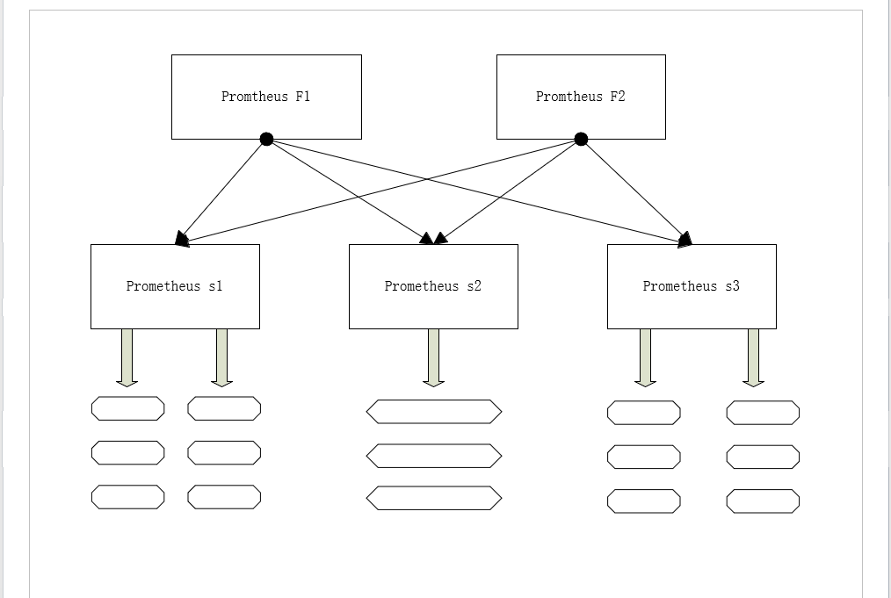
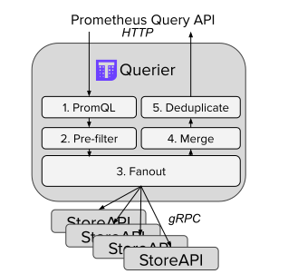

# thanos 

[TOC]

​        为了解决prometheus缺少多集群监控的全局视图，以及对历史数据的存储问题，Improbable开源了他们的prometheus高可用解决方法thanos，thanos与prometheus无缝集成，并为prometheus带来了全局视图和不受限制的历史数据存储能力。

## prometheus多集群监控方案

​        每个集群内部都部署一套单独的prometheus，在通过grafana等展示工具分别查看每个集群的资源监控情况，如果保证数据的高可用，则每个集群还需要一套数据备份方案以及历史数据存储方案。

## prometheus联邦

### 联邦实现

扩展单个prometheus的采集能力和存储能力，多个prometheu组成联邦，如下图所示：



​        最上面一层prometheus是联邦节点，负责从下面的prometheus中定时获取数据并汇总，部署多个联邦节点是为了实现高可用，下面一层的prometheus负责不同区域的数据采集，在多机房的部署架构中，每个prometheus又可以部署到单个机房，充当代理。
​        这种架构不仅降低了单个promtheus的采集压力，而且通过联邦汇聚核心数据，降低了本地存储的压力，为了避免下层prometheus的单点故障，可以部署多套prometheus节点，但是效率上会差很多，每个监控对象会被重复采集，数据会被重复保存。

### 联邦方案的不足

1. 这种架构配置相对复杂，缺少统一的全局试图
2. 对历史存储问题仍未得到解决，必须依赖第三方存储，并且缺少针对历史数据的降准采样能力
3. Prometheus在设计之初就是一款实时的监控系统


## [Thanos](https://thanos.io/tip/thanos/design.md/)

​        Thanos是一组组件，可以组成具有长期存储功能的高可用性Prometheus设置。其主要目标是简化操作并保留Prometheus的可靠性。thanos依赖于prometheus,且仅支持prometheus2.0版本之后得数据格式。

### Thanos的实现

Thanos架构图如下图所示，主要由四个组件组成：Querier、Slidercar、Store和Compactor。


#### Sidercar

每个prometheus节点都配置了一个Sidercar组件，通过K8S的部署可以将Prometheus和Sidercar容器集成到一个容器中，sidercar主要有两个作用和一个后来新增的可选功能，一是用来代理Querier对Prometheus本地数据的读取；二是将Prometheus本地的监控数据（一般是未压缩的块）通过对象存储接口保存到对象存储中，sidercar每30s读取一次本地元数据，看是否有新的监控数据产生，如果有则读取本地数据块将其上传到对象存储，标记最新的读取时间并且通过本地的JSON文件保存相关信息，包含块的元信息，例如统计信息，时间范围和压缩机别，避免重复上传。还有一个可选功能，sidercar可以查看prometheus规则和配置，并在需要时解压缩和替换环境变量，并ping  prometheus以便重新加载规则和配置。

#### Querier

Querier是thanos实现多集群监控以及全局视图的关键。
Querier接收HTTP的PromQL查询，组件负责数据查询汇聚，查询流程如下图：



简而言之，就是从基础StoreAPI收集评估查询所需的数据，评估查询并返回结果。Querier是完全无状态的并且可以水平扩展。Thanos Querier本质上允许在单个Prometheus Query端点下聚合和可选地对多个度量后端进行重复数据删除。
对于Querier来说，后端是实现gRPC StoreAPI的所有内容，因此我们可以从任意数量的不同存储中聚合数据,例如：
	*  prometheus（需要包含sidercar）
	*  对象存储
	*  记录规则和警报规则
	*  符合promtheus远程读写的标准的数据库
	*  另外一个querier
	*  非prometheus系统，例如OpenTSDB
querier不仅可以从多个后端获取数据，将他们汇总还可以对其中的重复数据删除，必须为整个集群选择固定的单 个或多个副本标签，然后在启动时将其传递给查询节点。仅通过给定副本标签区分的两个或多个序列将合并为一个时间序列。这也掩盖了单个数据源收集方面的差距。

Thanos公开的查询API保证与Prometheus 2.x API兼容。但是，对于Prometheus之上的其他Thanos功能，Thanos添加了三个特色的功能：
	* 部分反应行为
	* 部分新增的参数字段
	* 自定义响应字段。


1.  部分反应

querier可以从多个后端查询数据，当其中的一个StoreAPI返回错误或者超时，另两个返回成功结果（很可能出现），并不意味丢失数据，可能是因为出问题的StoreAPI没有查询到数据，则会汇聚有数据的查询返回。
如果发生部分响应，则StoreAPI会返回可读的警告，现在支持两种策略：
- warn
- abort(默认)

如果可用性比准确性更重要，可以配置严苛的超视规则：
```yaml
--query.timeout
--store.response-timeout
```

2. 新增的部分参数

  

  Deduplication replica labels. 

  | HTTP URL/FORM parameter | Type       | Default                                      | Example                                         |
  | ----------------------- | ---------- | -------------------------------------------- | ----------------------------------------------- |
  | `replicaLabels`         | `[]string` | `query.replica-label` flag (default: empty). | `replicaLabels=replicaA&replicaLabels=replicaB` |
  |                         |            |                                              |                                                 |

  这将覆盖query.replica-label cli标志，以允许在查询时使用动态副本标签。

  ##### Deduplication Enabled 

  | HTTP URL/FORM parameter | Type      | Default                                                      | Example                                |
  | ----------------------- | --------- | ------------------------------------------------------------ | -------------------------------------- |
  | `dedup`                 | `Boolean` | True, but effect depends on `query.replica` configuration flag. | `1, t, T, TRUE, true, True` for “True” |
  |                         |           |                                                              |                                        |

  这控制是否应使用副本标签对查询结果进行重复数据删除。

  ##### Auto downsampling 

  | HTTP URL/FORM parameter | Type                                   | Default                                                      | Example |
  | ----------------------- | -------------------------------------- | ------------------------------------------------------------ | ------- |
  | `max_source_resolution` | `Float64/time.Duration/model.Duration` | `step / 5` or `0` if `query.auto-downsampling` is false (default: False) | `5m`    |
  |                         |                                        |                                                              |         |

  最大源分辨率是我们要用于查询数据的最大分辨率（以秒为单位）。 This means that for value:

  - 0 -> we will use only raw data.
  - 5m -> we will use max 5m downsampling.
  - 1h -> we will use max 1h downsampling.

  #####  Partial Response Strategy 

  // TODO(bwplotka): Update. This will change to “strategy” soon as [PartialResponseStrategy enum here](https://github.com/thanos-io/thanos/tree/438b90924d794108454915b38b4a09a7c15bc500/pkg/store/storepb/rpc.proto)

  | HTTP URL/FORM parameter | Type      | Default                                       | Example                                |
  | ----------------------- | --------- | --------------------------------------------- | -------------------------------------- |
  | `partial_response`      | `Boolean` | `query.partial-response` flag (default: True) | `1, t, T, TRUE, true, True` for “True” |
  |                         |           |                                               |                                        |

  如果为true，则所有将不可用的storeAPI（因此不返回任何数据）将不会导致查询失败，而是返回警告。

3. 自定义响应数据结构

```go
type queryData struct {
	ResultType promql.ValueType `json:"resultType"`
	Result     promql.Value     `json:"result"`

	// Additional Thanos Response field.
	Warnings   []error          `json:"warnings,omitempty"`
}
```
#### Store
Store在对象存储中的历史数据之上实现StoreAPI,使对象存储中的数据可以作为querier查询的后端。Store主要有两个作用，一个在对象存储中数据实现StoreAPI,使对象存储中的数据可以被查询，二是充当一个API网关，可以负责所有storeAPI的服务发现，因此Store不需要大量的本地磁盘空间。它在启动的时候加入thanos集群，并发布它可以安全访问的数据。他在本地磁盘上保留有关所有远程块的少量信息，并使它与桶同步。
通常，对象存储桶中存储的每个TSDB块平均需要6 MB的本地磁盘空间，但是对于带有大标签集的高基数块，它甚至可以增加到30MB甚至更多。它用于预先计算的索引，其中包括符号和发布偏移量以及元数据JSON

Store查询对象存储的历史数据时，查看对象存储中的所有数据，并根据查询的时间范围将其返回，将对象存储的数据转化为Querier所需的数据格式，并且Thanos Store --min-time，--max-time标志使您可以基于恒定时间或相对于当前时间的持续时间对Thanos Store进行分片。
Thanos Store Gateway可能不会立即获取新块，因为时间划分部分是在异步块同步作业中完成的，默认情况下每3分钟完成一次。此外，某些对象存储实现还提供了最终的写后读一致性，这意味着Thanos Store可能不会立即获得新创建和上载的块。
建议与Thanos Sidecar和其他Thanos Store网关有重叠的时间范围，因为这将提高您的故障应变能力。

Thanos Store Gateway支持索引缓存，以加快从TSDB块索引进行发布和系列查找的速度。支持两种类型的缓存：

- in-memory（默认）
- memcached


#### Compactor
 Compator是一个批处理组件，主要针对对象存储的数据压缩，可以将历史的小对象（block,块）合并压缩成大文件对象，对其数据并且删除这些小文件，从而节省存储占用。通常，它在不是并发安全的，必须针对存储桶以单例方式进行部署，并且由于没有针对所有对象存储提供的安全锁定机制，因此，您现在需要自己确保只有单个Compactor针对单个存储桶中的单个块流运行。

Compator是thanos实现无限存储的关键组件。

Compator主要有两个作用，一个是负责对数据的压缩，另一个是负责历史数据的降准。

- 数据压缩

Compator负责将多个块压缩成一个，跟prometheus中进行的减少块数和压缩索引的过程实一样的，根据时间以及数据量的不断增长，Compator将sidercar上传的数据压缩成2h的块，然后在对历史数据再进行压缩，根据设定的步长倍数递增，如果步数为3、步长为3，则会块的大小分别为2h、6h、18h。数据量继续增长，Compator会将小的block合成一个大的block从而节约空间，也便于对数据进行检索。

- 数据降准

对历史数据的检索需要用降准的方式进行：如果检索一天的数据，则通常以h或者10min中为维度；如果检索一个月的数据，则通常以d或者h为准度，因为，在浏览器渲染数据的时候，如果检索时间很长，维度很小，则代表着会有大量的数据，甚至会超过屏幕的像素显示上限，从而失去意义，且网络的IO消耗，接口响应时间也会很高，所以需要将数据进行降准。
Thanos会将原始的监控数据降准汇聚，将初始30s为周期的监控数据讲过两次压缩后，汇聚成以1h为周期的数据。第一次从30s进行10倍压缩到5m，在进行12倍压缩到1h，数据的降准比较简单，需要汇聚 count(个数)、sum、min和max。

Compator对资源的要求比较高，尤其是内存
**CPU**：提供压缩组时要使用的goroutine数的核数
**内存**：
内存使用情况取决于对象存储中的块大小和压缩并发。
通常，最大内存利用率与用于压缩过程的Prometheus完全相同：

对于考虑进行压缩的每个源块：
    所有块符号的1/32
    所有块的过帐偏移量的1/32
具有所有标签和所有块的单个系列。
您需要将此乘以X，其中X是--compaction.concurrency（所需要的goroutine数量，默认情况下为1）。
通常，对于中型存储桶，限制为10GB的内存足以保持其正常工作。

**网络**:
Compator是对对象存储使用网络最多的组件，因此最好将其放在存储桶的区域附近。他必须要下载压缩/降准采样所需要的每个块，并在每次执行上传压缩/降准采样完成的块。还会经常刷新存储桶的状态。
**磁盘**
Compator需要本地磁盘空间来存储中间数据以进行处理,以及对存储桶状态缓存。通常，对于中型存储桶，随着压缩时间范围随着时间的增长，大约100GB应该足以继续工作。但是，这在很大程度上取决于块的大小。在最坏的情况下，压实机必须有足够的空间来容纳2个星期（如果您的最大压实级别为2周）的2倍的较小块来进行压实。首先，下载所有这些源代码块，其次是基于由较小的源代码组成的2周块的磁盘输出。

您需要将此乘以X，其中X是--compaction.concurrency（默认情况下为1）
## thanos的服务发现

thanos的querier会通过StoreAPI获取每一个sidercar的数据，那么首先需要发现sidercar，thanos引入了Gossip，现在已经不推荐使用，现在推荐使用的有三种：

- 静态配置：配置在组件的配置文件中
- 文件发现：将sidercar的信息写道文件中，json或者yaml格式,然后通过监视文件列表中的文件变化，在发生更改时，将动态加载新配置，所有文件重新读取的间隔为5分钟
- DNS服务发现（推荐）：DNS服务发现是用于查找可以与静态标志或文件SD结合使用的组件的另一种机制。使用DNS 服务发现，可以指定一个域名，并将定期查询该域名以发现IP列表。

## thanos支持的对象存储列表

thanos实现无限存储的主要资源对象，就是对象存储，最好单例对象存储。thanos将所有的历史数据都存储在对象存储中，减少prometheus使用的本地存储，使prometheus仅保存最近时间的数据，这样既节省了资源的消耗，也提高了prometheus的效率。
目前thanos支持的对象存储有：

| Provider                                                     | Maturity           | Aimed For             | Auto-tested on CI | Maintainers             |
| ------------------------------------------------------------ | ------------------ | --------------------- | ----------------- | ----------------------- |
| [Google Cloud Storage](https://thanos.io/tip/thanos/storage.md#gcs) | Stable             | Production Usage      | yes               | @bwplotka               |
| [AWS/S3](https://thanos.io/tip/thanos/storage.md#s3) (and all S3-compatible storages e.g disk-based [Minio](https://min.io/)) | Stable             | Production Usage      | yes               | @bwplotka               |
| [Azure Storage Account](https://thanos.io/tip/thanos/storage.md#azure) | Stable             | Production Usage      | no                | @vglafirov              |
| [OpenStack Swift](https://thanos.io/tip/thanos/storage.md#openstack-swift) | Beta (working PoC) | Production Usage      | yes               | @FUSAKLA                |
| [Tencent COS](https://thanos.io/tip/thanos/storage.md#tencent-cos) | Beta               | Production Usage      | no                | @jojohappy              |
| [AliYun OSS](https://thanos.io/tip/thanos/storage.md#aliyun-oss) | Beta               | Production Usage      | no                | @shaulboozhiao,@wujinhu |
| [Local Filesystem](https://thanos.io/tip/thanos/storage.md#filesystem) | Stable             | Testing and Demo only | yes               | @bwplotka               |


## 相关参考

thanos的参考视频：https://www.youtube.com/watch?v=qQN0N14HXPM&t=714s
thanos的项目地址：https://github.com/thanos-io/thanos
thanos官网：https://thanos.io/tip/thanos/design.md