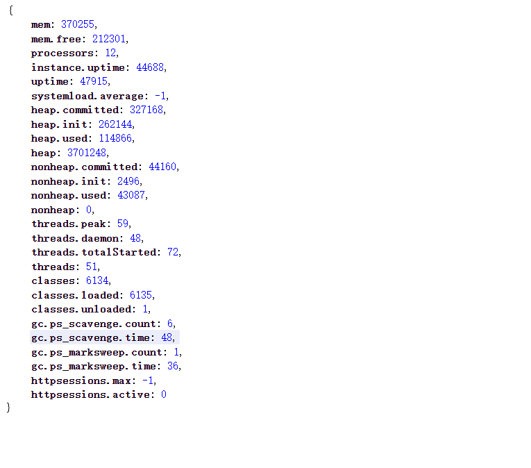
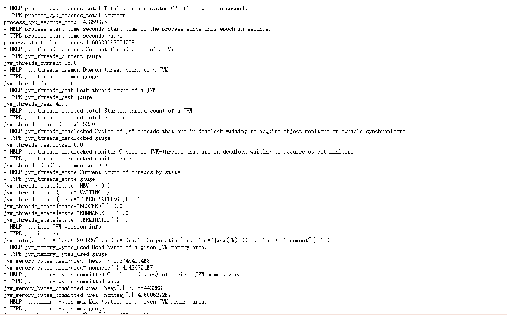

# 基于SpringBoot监控Java项目的指标

遇到很多想要查看项目运行期间的相关监控数据的情况，基于此种需求做出一个较简单但准确的方案，使用springboot自带的端点来监控。

## 监控java项目有哪些方案

1. 在启动的时候添加额外的监控jar包，使用代理来获取监控数据 参考   [阿里云](https://help.aliyun.com/document_detail/63797.html?spm=5176.2020520107.0.0.8joN3c#SPRINGBOOT) 
2. 自己写一个项目内采集监控数据的接口,参考  [prometheus-client-java](https://github.com/prometheus/client_java) 
3. 使用springboot自带的相关端口来获取内置的指标值，可以参考本文档。

本文介绍简单操作的无侵入的方式

## springboot内置端口

在**springboot**启动的时候，会默认暴露一些服务端口，比如常见的   **/info** 、**/health** 等，后来在  **springboot2.x**  ，将一些端口视为隐私受保护的就不再默认开放了，需要用户去手动开启。这些端口包含了一个 **/metrics**端口，该端口就是展示springboot内部的指标的端口，默认是关闭。

关于开启的端口可以参考官方文档 ： [springboot-endpoints](https://docs.spring.io/spring-boot/docs/2.1.1.RELEASE/reference/html/production-ready-endpoints.html) 

### prometheus
 **[prometheus](https://prometheus.io/)**  是CNCF孵化的第二个开源项目，是云原生时代的标准监控组件，它定义了一种监控方式以及指标数据的展示方式，是强大的监控工具，更是强大的时序数据库。现在很多软件都支持并默认有暴露prometheus格式的指标数据接口，springboot也不例外，那就是  **/prometheus ** ,该端口提供比metrics端口更详细的指标数据以及更友好的查看形式。

## 如何使用

上文已经说过对于springboot来说 1.x版本和2.x已经不同了，所以接下来如何配置我会区别开来说

prometheus端点的配置，兼容metrics端点。

### springboot1.x

#### metrics端点
- 依赖：

```pom
<dependency>
    <groupId>org.springframework.boot</groupId>
    <artifactId>spring-boot-starter-web</artifactId>
</dependency>
<dependency>
   <groupId>org.springframework.boot</groupId>
   <artifactId>spring-boot-starter-actuator</artifactId>
</dependency>
```

- 配置文件

	1. 要想访问需要将端口设置为非敏感

    ```yml
    endpoints:
      metrics:  # 配置该端口得配置
        enabled: true   # 打开该端口
        sensitive: false # 设置不是敏感数据，可以免保护直接访问
    ```

	2. 直接把安全保护关掉，所有得端口都能访问

    ```yml
    management:
      security:
        enabled: false
    ```

以上配置二选一，还可以使用其他配置指定额外的管理端口来 如下：

```yml
management:
  port: 8081   # 将管理端口重置为8081，访问 /metrics端点就需要使用 8081/metrics
```


- 结果
访问 ip+port/metrics  即可
如图所示，可以看到直接展示内存，垃圾回收等相关的指标数据



#### prometheus端点

springboot内置有prometheus端口，但是需要额外的采集器来支持这个端口的数据，使用如下：

- 依赖：

```pom
<dependency>
    <groupId>io.prometheus</groupId>
   <artifactId>simpleclient_hotspot</artifactId>
   <version>0.9.0</version>
</dependency>
<dependency>
   <groupId>io.prometheus</groupId>
   <artifactId>simpleclient_spring_boot</artifactId>
   <version>0.9.0</version>
   <!--内含springboot1.5.4 spring-boot-starter-actuator-->
</dependency>
<dependency>
	<groupId>org.springframework.boot</groupId>
	<artifactId>spring-boot-starter-web</artifactId>
</dependency>

```

- 修改启动类

```java
import io.prometheus.client.hotspot.DefaultExports;
import io.prometheus.client.spring.boot.EnablePrometheusEndpoint;
import io.prometheus.client.spring.boot.EnableSpringBootMetricsCollector;
import org.springframework.boot.SpringApplication;
import org.springframework.boot.autoconfigure.SpringBootApplication;

import javax.annotation.PostConstruct;

@EnableSpringBootMetricsCollector
@EnablePrometheusEndpoint
@SpringBootApplication
public class DockerDemoApplication    {

	public static void main(String[] args) {

		SpringApplication.run(DockerDemoApplication.class, args);
	}
	@PostConstruct
	public void init(){}{
	//初始化采集器
		DefaultExports.initialize();
	}
}

```


- 配置文件
	1. 要想访问需要将端口设置为非敏感
	```yml
	endpoints:
	  metrics:  # 配置该端口得配置
	    enabled: true   # 打开该端口
	    sensitive: false # 设置不是敏感数据，可以免保护直接访问
	  prometheus:
	#    path: prometheus-metrics  # 可以重写该端口的路径
	    enabled: true
	    sensitive: false
	```
	
	2. 直接把安全保护关掉，所有得端口都能访问
	
	```yml
	management:
	  security:
	    enabled: false
	```

以上配置二选一，还可以使用其他配置指定额外的管理端口来 如下：

```yml
management:
  port: 8081   # 将管理端口重置为8081，访问 /metrics端点就需要使用 8081/metrics
```

- 结果

访问 ip+port/prometheus 即可
如图所示，可以看到很多指标，该指标是prometheus风格的指标


**[指标解释](https://prometheus.io/docs/concepts/metric_types/) ：**

HELP 代表了指标的定义含义
TYPE 定义了指标属于什么类型，有四种类型，

1. Counter
计数器,一个计数器是代表一个累积指标单调递增计数器，其价值只能在重新启动增加或归零。例如，您可以使用计数器来表示已服务请求，已完成任务或错误的数量。

2. Gauge
指示盘，表示单个数值，可以任意地上升和下降的度量。
通常用于测量值，例如温度或当前内存使用量，还用于可能上升和下降的“计数”，例如并发请求数。

3. Histogram
直方图样本观测（通常之类的东西请求持续时间或响应大小）和计数它们配置的桶中。它还提供所有观察值的总和。

4. Summary
类似于直方图，摘要会采样观察值（通常是请求持续时间和响应大小之类的东西）。虽然它还提供了观测值的总数和所有观测值的总和，但它可以计算滑动时间窗口内的可配置分位数。

具体的值就代表了指标的值，花括号内部指的是这个指标的维度


### springboot 2.x
springboot 2.x 在所有的管理端点之前都加了一个  **/actuator**  前缀

#### metrics端点

- 依赖

```pom
<dependency>
   <groupId>org.springframework.boot</groupId>
   <artifactId>spring-boot-starter-actuator</artifactId>
</dependency>
<dependency>
	<groupId>org.springframework.boot</groupId>
	<artifactId>spring-boot-starter-web</artifactId>
</dependency>
	
```

- 配置文件

```yml
management:
  endpoints:
    web:
      exposure:
        include: prometheus,metrics  # 开启的端点
    jmx:
      exposure:
        include: prometheus,metrics  # 开启的端点
  server:
    port: 8081  # 可重置管理端口

```

- 结果：
访问http://localhost:8081/actuator/metrics 如下图所示
springboot2.x 暴漏出来的数据跟springboot1.x有点不同，如图所示，springboot2.x metrics端点只展示能展示的指标值，并不展示具体的值，具体的值如何去看还需要在进一步。

比如我想要看  **jvm.memory.max** 数据，就需要访问 http://localhost:8081/actuator/metrics/jvm.memory.max 这个端点来获取，在/metrics的后面加上  /想看的指标name


#### prometheus端点

跟springboot1.x一样，springboot内部是没有prometheus采集的实现的，可以发现我们在配置文件重暴漏了prometheus端口也是访问不到的。因为没有被支持，所以我们需要增加额外的配置来支持prometheus端点。

在此我们使用 **[千分尺](https://micrometer.io/docs)** 来支持，也是springboot官方推荐的。

- 依赖：

```pom
		<dependency>
			<groupId>org.springframework.boot</groupId>
			<artifactId>spring-boot-starter-web</artifactId>
		</dependency>
		<dependency>
			<groupId>org.springframework.boot</groupId>
			<artifactId>spring-boot-starter-actuator</artifactId>
		</dependency>
		<dependency>
			<groupId>io.micrometer</groupId>
			<artifactId>micrometer-registry-prometheus</artifactId>
			<version>1.5.1</version>
		</dependency>
		<dependency>
			<groupId>io.micrometer</groupId>
			<artifactId>micrometer-core</artifactId>
			<version>1.5.1</version>
		</dependency>
```

- 配置文件

```yml
management:
  endpoints:
    web:
      exposure:
        include: prometheus,metrics  # 开启的端点
    jmx:
      exposure:
        include: prometheus,metrics  # 开启的端点
  server:
    port: 8081  # 可重置管理端口

```


- 结果
访问http://localhost:8081/actuator/prometheus 如下图所示，可以直接看到prometheus端口的指标数据


如何解析查看参考以上的prometheus数据规格。

## 结语
对于项目的监控相对重要，希望能帮助到各位，有问题请联系我。


