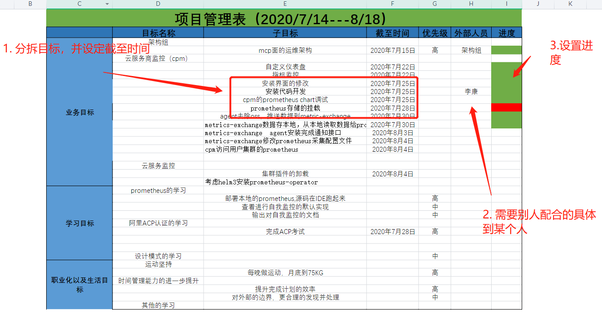
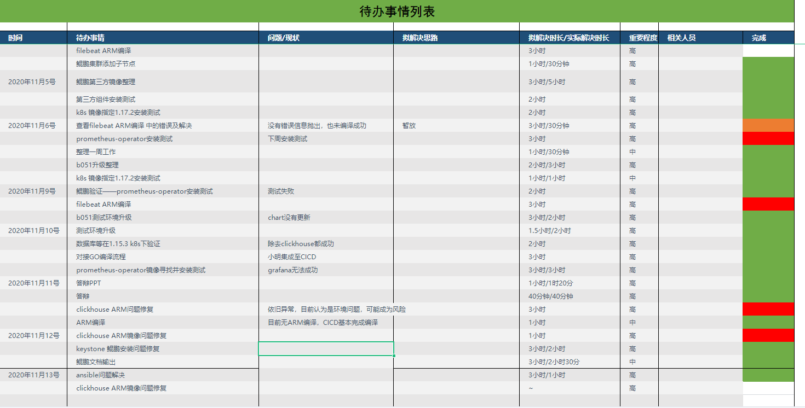

# 时间管理

作为一名互联网工作从业者，忙碌的工作和快节奏的生活是我们的常态。能否让自己的工作高效且有序的完成，是下班后心情是否舒畅的一个标准。而时间管理就是来帮助我们更有序的规划自己的时间，更高效的完成自己的计划。

## 引言

为什么要做这样一个分享，在年初的时候，疫情出现。。。此处是省略一下。。。 原课程在《得到APP》- **《怎么成为时间管理的高手》** ，感兴趣的可以去听听原课程，9.9包邮。 时间管理对于我们每一个人，都是比较重要的技能点，时间管理对个人的工作生活都能起到很大的帮助，好处我就不一一列举了，去年的时间管理大师罗志祥的事迹还历历在目。当然我们大部分都是普通人，没有那么好的精力去夜夜修仙，而且我们也应该把时间用在做正确的事情上。 接下来我会分几部分来做时间管理的分享，并辅以我们组的一些工具来说。

## 计划

做好一个起始计划是成功的第一步，更是时间管理重要的第一步

### 什么是计划

计划的本质是规划和备忘，当然最重要的还是规划。每个人做规划，都是要在大脑里有个雏形，那么此时的雏形也可以是你的计划，但是，好记性不如烂笔头，将头脑的计划书面化，可视化才算是有效，书面化之后，就有了备忘的功能。所以计划就是将你脑子里的初步规划合理书面化。

### 如何做计划

有了头脑规划后，如何才能将这个规划书面化呢，就需要合理的来做计划了。给大家介绍两个做计划的小工具：项目管理表和日历表

#### 极简的项目管理表

项目管理表应该记录着你几个月内要做的事情，时间跨度范围比较大，类比到我们的工作中就是每个迭代的版本计划。做项目管理表有一下几个参考原则：

* 分拆子项目和设定截至时间
* 不宜把工作和时间拆的过细，时间颗粒度到计划周期的下两级即可
* 项目拆分不漏不重
* 项目需要别人配合的，要责任到每一个人
* 写下任务的相关方，并设置进度提示

我们组最开始新建了一个共享文档，来做我们每个人的项目管理表，因为我们每个迭代的计划都会写到成长计划中，后来逐渐弃用。一个合理的项目管理表，记录规划着你一段时间内要做的事情。下面是我之前制定的一个项目管理表，仅供参考：

#### 日历表

日历表代表着每天要做的事情，最好前一天晚上就把第二天要做的事情计划好，日历表的制定也有以下几个参考原则：

* 重要的事情先安排
  * 短期需要完成的，交付的。
  * 短期对业绩和个人表现没有明显帮助，但时间久就有巨大红利的事情，比如看书，健身。
  * 不能错过的重要事情节点，比如，重要会议，约定好的时间节点
* 不要填满每个小时，要留有余地，具有缓冲地带
  * 缓冲时间一半设置为20%，根据自我能力和工作难度来定。
* 日计划：一天任务的清单
  * 结合项目管理表和日历表写下一天要完成的内容
  * 每天结束后划掉完成的事情，或者设置标记。

日历表我们组也做了一个共享文档，用来给每个人做每天的日历计划，已经坚持了大约五个月，随机抽取陈行的日历表作为展示：

形式可以自己定，也可以写在印象笔记上，根据我以上列举的原则来制定，并且根据自己的习惯，不断进行优化表的结构，长久下来一定能帮你做出一个合理的适用于你自己的日历表。

## 执行计划-把时间变成产出

好的计划是成功的第一步，而执行好计划是关键且重要的一步，制定好了合理的项目管理表和日历表之后，我们就要去高效的去按计划实施。同样我也分享几点执行计划的方法给大家：

### 把任务变成动作

每一条计划就相当是一个任务，而把任务变成动作将是我们执行计划起来更加高效。将笼统的，大的任务转变成可以去执行的，可量化的动作，根据任务类型的不同我们来使用不同的方法：

#### 任务就是一个动作

比如发邮件，提交代码，这些任务只是一个动作，很短的时间就能完成，适用于放在日历表的第一个来执行。

#### 任务是一些大大小小的动作

比如一些任务需要你执行很多动作来完成，比如升级线上环境就是一个比较大的任务，所以我们应该将这些大的任务进行预拆分，或者进行预处理 可以将升级线上环境依次分为几个步骤 1. 收集升级范围 2. 处理原有数据，进行数据库的升级 3. 提交最新的代码，CICD出最新版本包 4. 线上升级容器 5. 校验升级后的环境

这样就能将一个大的任务拆分成一个个小的任务，建议在做日历表的时候就进行拆分，这样在执行的时候就能非常有序，每执行完一步之后，就做上已完成的标记。

#### 临时的任务

比如一些临时的问题，突然出现的BUG，临时的会议，等一些不在原计划之内的事情。

对于此类事情，我们都会遇到，首先遇到别人来找你的一些问题，需要快速做决定和快速行动的方法，如何对此类事情做决定，分享大家四个字 转、做、存、扔。 1. **转** ：转给别人，可以授权别人帮你完成的事情。 2. **做** ：确定要做的事，重要的事情，两三分钟就能完成的，立马做掉。比如项目出现了BUG，造成了阻断，就必须马上去解决。 3. **存** ：没有办法马上做完的，或者需要大块时间去做的，把它记下来。在晚上做计划的时候排进自己的日历表。 4. **扔** ：即转不出去，又没法立刻做掉的事情，也没有必要存下来以后做的事情，就扔掉。

#### 解决拖延症和纠结症

上面我分享了如何将任务拆解为一个一个的动作去做，已经相对比较细化了，但是有时候也会因为问题太难，或者纠结而造成拖延，此时应该调整好心态

1. 对于干扰多，事情杂的任务，使用快速做决定和快速行动的方法。
2. 当你觉得自己做不好的时候，换个思路：反正都要做，要积极的心态去面对，主动去做。
3. 不要一个人为难，多给同事上司交流，获得鼓励和建议。

## 调整心态和方法--敏捷工作法

计划我们用了，如何去完成计划也有了，还需要一个好的心态和高效的方式方法，这次为大家分享一个高效的工作法----敏捷工作法。

### 敏捷工作法

敏捷工作法和我们现在的敏捷开发是很相像的，使用敏捷工作法，避免时间浪费到努力上 1. 敏捷工作法就是指：不断调整适应，逐步去达到目标 2. 最小可交付

* 建立 **最小可交付** 意识，将工作分为 输入 、处理和交付，不断地循环打磨。
* 对于每件事情，可能没法一步到位，直接就把最终的搞好，但是每天每阶段的输入都需要有可较符的东西呈现
* 最小的可交付：拿得出手又不至于过于复杂，也是每天工作的结果，不至于白忙活而不知道忙活了啥
  1. 持续迭代：
* 迭代就是要一次一次比一次更好的交付
* 一方面有源源不断的输出，另一方面时间不会被浪费
* 重要的事情多迭代，紧急的事情先迭代

### 建立良好的心态

* 避免完美主义
  * 对于普通人来说，零误差，完美是不可能的，也是没必要的。写代码没有一个BUG是不可能的，如果出现了可能得考虑考虑为什么自己如此优秀。
  * 一旦你完美一次，周围的人对你的期待会提升，一旦你下次不完美就会非常失望。
  * 不要把时间浪费在做到完美上面，这种努力不一定能获得高回报，且付出的代价也很多。
  * 以上几条当然不是鼓励大家不要去做的那么完美，在生活中不是什么事情都需要做到100分满分，要有的放矢，该需要尽全力去做的还是要做好，而只需70分就可以的，没必要去死磕100。
* 避免范围蔓延
  * 范围蔓延就是做了超出自己范围的事情。
  * 不断让步，导致事情越来越多，不属于自己的事情学会拒绝。
  * 理清事情的边界，自己和外界的边界。
* 避免返工
  * 负责做一件事就要把事情做的可以被别人认同，避免做完后推到重做。
  * 在做计划的时候，尽量把异常情况考虑的尽可能全面一些，避免出现因为考虑不周重新做。

## 管理别人的时间

管理别人的时间，这个别人指的是合作者，职场离不开任何人的沟通和协作。上面我们说到做计划的时候需要把任务的相关方也列举到表格中，那么在合作完成的任务中又该如何去合理高效的管理时间呢。 首先自己的时间管理要清晰，之后如何管理别人的时间其实也就是沟通的问题，合作者的时间管理有两个特点：**开放透明** 和 **互相负责** 。 首先分享三个透明沟通的习惯

* 在做计划的时候，就把别人拉进来

    对于我们来说，尽量在项目迭代开始前，就与相关人员对齐任务内容，并协调好时间，这样大家可以对齐决策，充分同步信息，也可以避免盲点，比如，后端都做完了，前端也许都不知道这个迭代要做这个东西。

* 实时同步

    合作的任务如果能让合作者看到实时的进度，那么就更有利于资源的调动和协调，任务完成的也就更好。

* 尽可能的当面沟通，沟通重要的就是及时反馈

## 如何与忙碌相处

忙碌的人跟悠闲的人比起来，大概率更靠得住，行动力和能力都更强

### 避开”内卷化忙碌“

内卷化，原本是社会学家观察到的一个现象，它是指一个社会，长时期停留在一种简单的自我重复的状态。

* 忙碌不应该是一种状态，而应该是一种进步，不要去被动的忙碌，今天在赶昨天的进度，忙到没有时间去学习。而是要做时间的主人，合理规划，给自己成长的时间，主动去学习新知识新技能，提高业绩产出，增强自己的能力，这样的忙碌才能避免内卷化的忙碌。
* 自驱模式下的忙碌才能给我们自己带来能力的成长和内心的满足感。

### 形成自驱式忙碌

在职场有两个重点：一个是上级交给你的，另一个是你自己想挑战的。 1. 你的有一个 属于自己的好目标，每个月的成长计划中的职业化能力应该是我们实现目标的阶梯。 2. 给成长投入足够的投入。比如想要健身无法督促自己，那就花钱办卡，不去锻炼就是在亏钱，投入越心疼效果越好。~~花钱办了卡还要花时间去锻炼岂不是更亏~~。 3. 抛出一个小循环，制造机会让自己尝到甜头。投入时间去锻炼了，得有收获才能继续前行。隔段时间就拍张照，看看自己腹肌得增长可能会更坚持。

## 结语

学好时间管理，掌握美好人生。以上就是我们组内的时间管理学习分享，希望大家都能成为时间管理大师，生活越来越越开心。 最后一句话吧：

