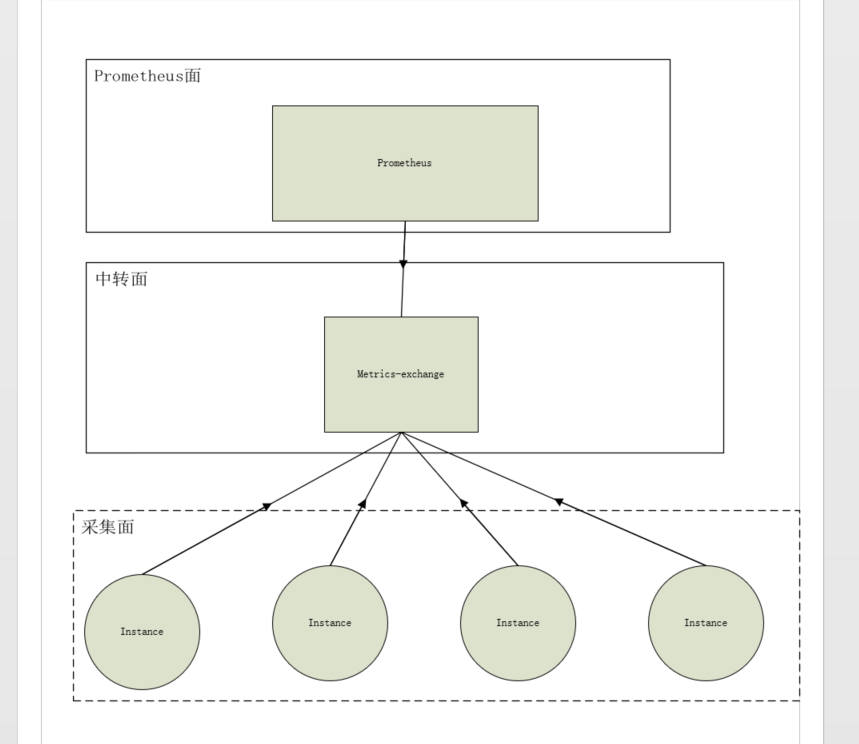

# prometheus配置额外的采集点

\[TOC\]

### 使用场景

1. 在日常使用中，prometheus除了启动的时候配置文件中的采集job外，我们还会额外再配置主机采集点；
2. 如果遇到一些采集点无法被prometheus主动拉取到，那么就需要我们做个代理，让prometheus统一访问这个代理，然后代理来根据请求参数来区分prometheus访问的主机实例指标

### 架构图

对于第一种情况，不需要额外的架构图来说明，只针对第二种情况来展示架构 

### 根据不同部署形式来配置

那么prometheus的配置文件如何配置呢？ 下面我们会针对prometheus不同的部署方式来做不同的配置

#### 单机非容器化部署

官方网站可以找到 [prometheus](https://prometheus.io/download/) 的安装包以及安装方式。

1. 安装prometheus,官网下载，解压运行：**./prometheus  --config.file=prometheus.yml**
2. 修改单机版的配置相对操作比较简单，有两种： 1. 直接在prometheus的配置文件 **prometheus.yml** 中指定要采集的点。

   ```yaml
    scrape_configs:
      # The job name is added as a label `job=<job_name>` to any timeseries scraped from this config.
      - job_name: 'prome'
        static_configs:
        - targets: ['localhost:9090']
          labels:
            id: prometheusInstance
            instance: promethes
      # 每一个job都是对应一个或多个采集点
      - job_name: 'test'
        metrics_path: /asasas/metrics
        static_configs:
        - targets: ['localhost:8000']
   ```

   1. 为了避免采集点太多，可以指定一个额外的配置文件来存储（可以热加载）,相当于是基于文件的服务发现。

      prometheus.yml:

      \`\`\`yaml scrape\_configs:

      **The job name is added as a label `job=<job_name>` to any timeseries scraped from this config.**

   2. job\_name: prome

      static\_configs:

   3. targets: \['localhost:9090'\]

      labels:

      id: prometheusInstance

      instance: promethes

      **当成一个大job来执行,**

   4. job\_name: node

      file\_sd\_configs:

   5. files:

      **该文件中的每一个targets都是一个采集点**

   6. node\_targets.yml

      **多就重新加载该文件**

      refresh\_interval: 10m

      \`\`\`

      node\_targets.yml文件: \`\`\`yaml

   7. targets:
      * localhost:8000

        labels:

        **这样写路径在该配置文件中是不对的，虽然是get请求，在主机板的prometheus可能也行的通**

        **metrics\_path**: /metrics?hhh=09&asa=ada
   8. targets:
      * localhost:8000

        labels:

        **metrics\_path**: /metrics

        \_\_param\_hhh: 343

        \_\_param\_aaa: ddd

        instance: ewaide
   9. targets:

      * localhost:8000

        labels:

        **metrics\_path**: /tianjiayige/metrics

        instance: tianjiayige

        \`\`\`

        有个需要注意的点：node\_targets.yml文件中每一个targets就是一个采集点，在单机版的prometheus如果采集路径写成：/metrics?hhh=09&asa=ada 也许是可以的，主要看后台的服务能不能解析，我后台用的go-gin来写的，就会报404

        所以应该把参数单独提出来写：

      ```yaml
      __param_<参数名>: <参数值>
      ```

#### 容器化部署  [prometheus-operator](https://github.com/helm/charts/tree/master/stable/prometheus-operator)   chart

现在云计算的脚步已经越来越来近了，很多公司都开始使用K8S集群来管理我们自己的应用，而监控大部分都会使用prometheus来做，而prometheus-operator是在容器化集群部署prometheus监控的最省心方便的形式，下面就来看看这种部署形式如何配置额外的采集点

在容器化部署的prometheus可以直接使用K8S的服务发现来监控集群内的各个服务、应用、存储等集群资源。而对于集群外的主机或程序就无法通过服务发现的形式来自动添加到监控，那么就需要我们手动的添加监控列表。 1. 添加一个ServiceMonitor\(chart定义的CRD\) 的监控点来实现，这种方式可以参考集群内已存在的ServiceMonitor来自己写一个对应的采集点，对于集群外的采集点不是很方便。 2. 官方的chart支持添加一个额外的secret,名称为{chart.name}-prometheus-scrape-confg,里面包含了一个配置文件：additioonal-scrape-configs.yaml，这个配置文件就是给用户添加额外的采集点，

* yaml文件的格式是如下所示，修改方法跟prometheus.yml文件添加一个job的配置是一样的

  ```yaml
  - job_name: node-test
    metrics_path: /myMetricsPath
    scheme: http
    params:
      parm1:
        - value1
      parm2:
        - value2
    static_configs:
      - targets:
          - localhost:9090
        labels:
          id: prometheusInstance
          instance: hello
  ```

* 如何开启：chart.values.yaml文件中修改如下，就会在安装chart的时候生成上面的secret,默认没有，之后添加采集点只需要修改该secret即可

  ```yaml
    prometheus:
    prometheusSpec：
      additionalScrapeConfigs：
      - job_name: node-test
        metrics_path: /myMetricsPath
        scheme: http
        params:
          parm1:
            - value1
         parm2:
            - value2
        static_configs:
          - targets:
              - localhost:9090
            labels:
              id: prometheusInstance
              instance: hello
  ```

#### 容器化部署 [prometheus](https://github.com/helm/charts/tree/master/stable/prometheus) chart

容器化部署prometheus也可以不使用prometheus-operator，而直接使用prometheus的chart，这种比较适合轻量级别的监控，或者需要定制化监控的需求。prometheus chart部署形式的配置，类似于prometheus单机部署配置：也是同样的两种，区别在于修改的地方有所区别

1. 直接修改prometheus的配置文件：prometheus.yml。chart对应的prometheus.yml在values.yaml里面的serverFiles.prometheus.yml

   ```yaml
    serverFiles:
      prometheus.yml:
        scrape_configs:
      - job_name: prometheus
        static_configs:
          - targets:
            - localhost:9090
   ```

2. 也是修改prometheus.yml。修改values.yaml的extraScrapeConfigs：直接指定额外的采集，在安装cahrt的时候，会自动的加载到prometheus.yml里面

   ```yaml
    extraScrapeConfigs:
       - job_name: 'prometheus-blackbox-exporter'
         metrics_path: /probe
         params:
           module: [http_2xx]
         static_configs:
           - targets:
             - https://example.com
   ```

以上两种就是通过修改prometheus.yml的方式，最终在部署完成后会生成一个configmap： prometheus-server。里面定义了prometheus.yml的内容。通过在chart的values.yaml的修改可以映射到最终的prometheus.yml文件

1. 添加一个额外的配置文件来存放采集点

上面我们说到，更改values.yaml文件会映射到prometheus.yml上，同样的原理也是修改配置文件，实现在最终的prometheus.yml中可以添加一个文件作为采集点的服务发现。

* 在values.yaml里面要声明该文件，会自动创建该文件，在pod里面的位置跟prometheus.yml同级

```yaml
serverFiles：
  node_targets.yml:
    - targets:
      - localhost:9090
      labels:
        __metrics_path__: /metrics
        __param_aa: 77
        __param_bb: cc
```

* 在prometheus.yaml处配置采集该文件中的实例。

  ```yaml
  serverFiles:
  prometheus.yml:
    scrape_configs:
  - job_name: prometheus
    static_configs:
      - targets:
        - localhost:9090
  - job_name: node
    file_sd_configs:
      - files:
        - node_targets.yml
  ```

  配置好后，可以在集群重看到一个configmap,名称为：prometheus-server,该配置文件中有多个文件，里面就包含我们添加的node\_targets.yml以及prometheus.yml，之后如果修改添加采集点，直接修改这两个文件即可

### 总结

prometheus的额外采集配置，无论那种部署形式都是支持的，通过修改prometheus.yml文件是最直接的，如果采集点多可以通过额外的文件来保存这些采集点，并把该文件配置到prometheus.yml文件中去，不知道如何配置prometheus.yml的话，这里有一个官方的示例：[prometheus.yml](https://github.com/prometheus/prometheus/blob/master/config/testdata/conf.good.yml)

prometheus-operator可以通过添加自定义crd的形式以及添加secret的形式添加额外采集配置，这个可能会比较普遍一些，prometheus-operator肯定还有其他的一些配置形式，日后用到也会分享出来。

